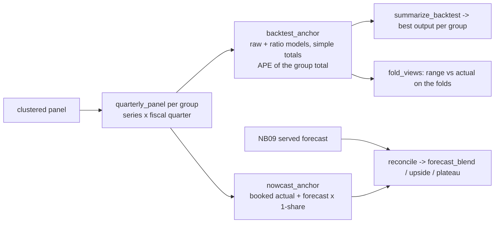

# Aggregate-Anchor-Reconciliation Skill

The monthly per-series forecast is the right operational grain; the **quarter total per family** is the
number the business signs off. Two facts drive this skill:

1. **Aggregation removes noise but not level shifts.** Summing hundreds of monthly forecasts is accurate in flat
   quarters and systematically low in surge quarters.
2. **A pooled quarterly model is a better judge of the total.** Its **upper quantile** is right in surge quarters
   (and over-forecasts flat ones); its **central estimate** is right in flat quarters (and misses surges).
   **Summing per-series `q50` under-forecasts a lumpy total** - anchor aggregates to `q75` / the L2 mean.

So publish a **range**: `blend` (bottom-up, no scaling) .. `upside` (blend scaled to the anchor's upper
quantile), with `plateau` (central estimate) as a technical column answering *"what if the surge stops?"*.
The scaling is applied to the validation folds exactly as to the served quarter, so the range has a track
record before anyone sees it.



## Usage

```python
from aggregate_anchor_reconciliation import (FiscalQuarters, backtest_anchor, summarize_backtest, nowcast_anchor,
                                             reconcile, fold_views)

fq = FiscalQuarters(fy_start_month=10)
groups = sorted(panel["product_family"].unique())
bt = backtest_anchor(panel, fq, groups, group_col="product_family", cats=["product_group", "region", "channel"], n_folds=5)
summary = summarize_backtest(bt)
print(summary.pivot(index="method", columns="group", values="mean_ape").round(1))

views = {"upside": "Q-LGBM raw q75", "plateau": "Q-LGBM ratio mean"}      # or "backtest" = best output per group
served_q = fq.index(served["ds"].min())
anchors = {g: nowcast_anchor(panel, fq, g, "product_family", cats, served_q, data_max, views, summary) for g in groups}

served["group"] = served["unique_id"].map(panel.groupby("unique_id")["product_family"].first())
served["forecast_blend"] = served["yhat_committed"]
reconciled = reconcile(served, anchors, group_col="group", future_col="is_future")
print(reconciled.groupby("group")[["forecast_blend", "forecast_upside", "forecast_plateau"]].sum() / 1e6)
```

## Workflow

1. Pick the aggregate level the business is held to (`group_col`) and the fiscal year start.
2. Backtest every output on the last 5 complete quarters; look at **mean signed error** as well as APE - the
   `q50` sums will be negative for the lumpy families.
3. Choose the view outputs **as a decision**: upper quantile for `upside`, central estimate for `plateau`
   (or `'backtest'` to take the best output per group).
4. Nowcast the served quarter; compare the anchor with any business estimate *after* the fold check, not before.
5. Reconcile; a factor below 1 means the anchor sits below the bottom-up (typical when rules or a strategic series
   lifted the blend) - the range then reads `upside .. blend`; both numbers still bracket the quarter.
6. Hand `forecast_blend` / `forecast_upside` / `forecast_plateau` to the reporting layer; keep `plateau` technical.

## Boundaries

- ✅ Any monthly panel with a group column constant per series; `lightgbm` required.
- ⚠️ The ratio target needs **mean-1 sample weights**; raw-scale weights break the quantile objective.
- ⚠️ A sum of per-series quantiles is an indicative band of the total, not a calibrated interval.
- 🚫 Not a substitute for coherent multi-level reconciliation (`hierarchical-reconciliation`); this anchors one level.

## Files

| File | Purpose |
|---|---|
| `aggregate_anchor_reconciliation.py` | fiscal quarters, quarterly panel, raw/ratio outputs, backtest, nowcast, reconcile, fold views |
| `templates/example_usage.py` | backtest + range on the advanced-track tables |
| `templates/aggregate_anchor_report.md` | report skeleton (backtest heat-map, fold range, served range) |
