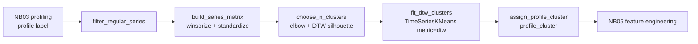

# DTW Clustering Skill

This skill **clusters the regular/smooth time series by shape using Dynamic Time
Warping (DTW)** as a **drop-in alternative to the Euclidean K-Means** step in
**notebook 04 (04 Clustering)**.

It keeps the *exact same pipeline shape and output contract* as notebook 04 — so
downstream notebooks (05 Feature Engineering, 06 Train/Tune) are unaffected — and
only swaps the **distance and assignment** step:

| Step | Notebook 04 (default) | This skill |
|------|-----------------------|------------|
| Filter | keep `profile == "regular"` | same |
| Winsorize | tails at 5% / 5% | same |
| Standardize | per-series scaling | same (`TimeSeriesScalerMeanVariance`) |
| Choose k | elbow + **Euclidean** silhouette | elbow + **DTW** silhouette |
| **Cluster** | **`sklearn` KMeans (Euclidean)** | **`tslearn` `TimeSeriesKMeans` (DTW)** |
| Output | `profile_cluster` on the profiling table | same |

## Why DTW instead of Euclidean K-Means

Euclidean K-Means compares two series **point-by-point at the same timestamp**, so
two series with the *same shape* but a small phase shift (a peak one week early, a
season that starts late) are judged far apart. **Dynamic Time Warping** aligns
series by *elastically stretching/compressing the time axis*, so it clusters by
**pattern/shape** rather than exact temporal alignment. Prefer DTW when the drivers
of consumption (promotions, holidays, weather) hit different series at slightly
different times.



## When To Use

| You want to… | This skill provides |
|--------------|---------------------|
| Restrict to the regular/smooth series | `filter_regular_series()` |
| Winsorize + standardize + build the DTW matrix | `build_series_matrix()` |
| Pick the number of clusters (shape-aware) | `choose_n_clusters()` (elbow + DTW silhouette) |
| Fit DTW clustering | `fit_dtw_clusters()` (`TimeSeriesKMeans`, `metric="dtw"`) |
| Reproduce the notebook-04 output | `assign_profile_cluster()` → `profile_cluster` |
| Count series per cluster | `cluster_summary()` |
| Summarize the result in prose | `narrate_clusters()` |
| Speed up / constrain warping | `sakoe_chiba_radius=...` on the fit/choose calls |

## Core Concepts

### The distance

DTW finds the minimum-cost alignment between two series by warping the time axis,
subject to boundary/monotonicity/continuity constraints. Two same-shaped but
time-shifted series get a **small** DTW distance where Euclidean would report a
large one. Cluster centroids are computed with **DTW Barycenter Averaging (DBA)**
inside `TimeSeriesKMeans`, so centroids are shape-representative rather than
point-wise means.

`metric` options:

| `metric` | Meaning | Notes |
|----------|---------|-------|
| `"dtw"` (default) | classic DTW + DBA centroids | shape-based, phase-tolerant |
| `"softdtw"` | differentiable soft-DTW | smoother, has a `gamma` param |
| `"euclidean"` | reproduces notebook-04 behaviour | sanity-check baseline |

### Choosing k (shape-aware)

`choose_n_clusters()` sweeps `k` and reports two diagnostics, mirroring notebook
04 but under the DTW metric:

- **Elbow** — the inertia (within-cluster DTW distance) curve, with the knee
  located by `kneed`.
- **DTW silhouette** — cohesion/separation computed with `tslearn`'s
  DTW-aware `silhouette_score` (not Euclidean), so it is consistent with how the
  series were clustered.

`suggested_k` is `max(elbow_k, silhouette_k)`, matching the notebook-04 default.
This is a **checkpoint**: present the diagnostics and confirm `k` with the data
scientist before fitting.

### Performance note

DTW is `O(n²)` in series length per pairwise comparison — much heavier than
Euclidean K-Means. To keep it tractable:

- Pass a **`sakoe_chiba_radius`** (e.g. `5`–`10`) to band the warping window; this
  both speeds DTW up and prevents pathological alignments.
- Keep `n_init` small (default `3`) and `max_iter` moderate (default `50`).
- Cluster only the **regular** series (the pipeline already excludes intermittent
  ones), which limits the series count.

## Output contract (identical to notebook 04)

The result is `df_profiling` plus a single string **`profile_cluster`** column:

- regular series → their DTW cluster id (as a string, e.g. `"0"`, `"1"`, …),
- every other profile (`intermittent`, `lumpy`, `erratic`, unforecastable) →
  its original profile label.

Save it as the `<scenario>_clustered` / `df_profiling_clustering` table, exactly
where notebook 04 writes, so notebook 05 needs no change.

## Workflow

1. **Confirm inputs.** The prepared panel (`df_final`: `unique_id`, `date_var`,
   `y`) and the profiling table (`df_profiling` with a `profile` column) from
   notebook 03. Confirm the column names and the `regular` label.
2. **Filter.** `df_reg, ids = filter_regular_series(df_final, df_profiling, ...)`.
3. **Build the matrix.** `X, ids, wide = build_series_matrix(df_reg, ...)`.
4. **Choose k (checkpoint).** `diag = choose_n_clusters(X, sakoe_chiba_radius=...)`;
   present `elbow_k`, `silhouette_k`, `suggested_k`; confirm `k`.
5. **Fit.** `labels_df, model = fit_dtw_clusters(X, ids, n_clusters=k, ...)`.
6. **Assign.** `df_clustered = assign_profile_cluster(df_profiling, labels_df, ...)`.
7. **Describe & save.** `cluster_summary(...)`, `narrate_clusters(...)`, then write
   `df_clustered` to the `<scenario>_clustered` table.

## Usage

```python
from clustering_dtw import (
    filter_regular_series,
    build_series_matrix,
    choose_n_clusters,
    fit_dtw_clusters,
    assign_profile_cluster,
    cluster_summary,
    narrate_clusters,
)

UNIQUE_ID, DATE_VAR, TARGET = "STORE_LOCATION_ID", "WEEK_START_DT", "TOTAL_NET_SALES"

# 1) regular series only
df_reg, regular_ids = filter_regular_series(df_final, df_profiling, unique_id=UNIQUE_ID)

# 2) winsorize + standardize + dense (n_series, n_timestamps, 1) array
X, ids, wide = build_series_matrix(df_reg, UNIQUE_ID, DATE_VAR, TARGET)

# 3) choose k under the DTW metric (checkpoint) — band the warp for speed
diag = choose_n_clusters(X, k_range=range(2, 8), metric="dtw", sakoe_chiba_radius=5)
print(diag["elbow_k"], diag["silhouette_k"], diag["suggested_k"])

# 4) fit DTW clustering with the confirmed k
labels_df, model = fit_dtw_clusters(
    X, ids, n_clusters=diag["suggested_k"], unique_id=UNIQUE_ID,
    metric="dtw", sakoe_chiba_radius=5,
)

# 5) reproduce the notebook-04 output contract
df_clustered = assign_profile_cluster(df_profiling, labels_df, unique_id=UNIQUE_ID)

print(cluster_summary(labels_df, unique_id=UNIQUE_ID))
print(narrate_clusters(labels_df, diagnostics=diag, metric="dtw", unique_id=UNIQUE_ID))
```

## Dependencies

- **`tslearn`** (>=0.6.3) is required for `TimeSeriesKMeans`, the DTW
  `silhouette_score`, and `TimeSeriesScalerMeanVariance`. It is **not yet** in
  `requirements.txt` (the pipeline ships `scikit-learn`, `scipy`, `kneed`). Add it
  before running and **flag it as a new dependency at the phase checkpoint**:

  ```
  tslearn>=0.6.3
  ```

- `scipy` (winsorize) and `kneed` (elbow) are already in the pipeline.

## Boundaries

- ✅ Cluster the regular/smooth series by shape with DTW; choose `k` with an
  elbow + DTW-silhouette sweep; write the notebook-04 `profile_cluster` output.
- ✅ Support `dtw`, `softdtw`, and `euclidean` metrics; optional Sakoe-Chiba band.
- ⚠️ `tslearn` is a **new dependency** — confirm/install it first.
- ⚠️ DTW is `O(n²)` per pair and far slower than Euclidean K-Means — use
  `sakoe_chiba_radius`, keep `n_init` low, and cluster only regular series.
- ⚠️ Choosing `k` is a **checkpoint** — present diagnostics and confirm with the
  data scientist before fitting (as notebook 04 does).
- ⚠️ Only **regular** series are clustered; all other profiles keep their label.
- 🚫 Do not re-profile series (that is notebook 03) or change the downstream
  output schema — the `profile_cluster` contract must stay identical to notebook
  04 so notebooks 05/06 are unaffected.

## Files

| File | Purpose |
|------|---------|
| `clustering_dtw.py` | Core functions: filter regular series, build the DTW matrix, choose k (elbow + DTW silhouette), fit `TimeSeriesKMeans(metric="dtw")`, assign `profile_cluster`, summarize/narrate. |
| `templates/clustering_dtw_report.md` | Stakeholder-ready clustering report (method, k choice, cluster sizes, vs Euclidean). |
| `templates/example_usage.py` | End-to-end runnable example against the pipeline tables. |
