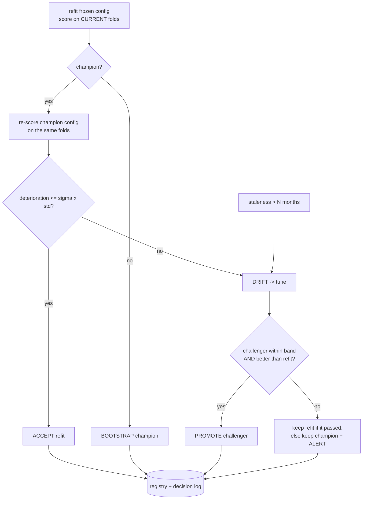

# Drift-Gate-Champion-Challenger Skill

A production forecasting recipe is **refit every cycle** (new months, same recipe) and **retuned only when
the evidence says so**. This skill is the gate that decides, plus the two append-only tables that give the
job state between runs.



## The gate, and the five review findings it encodes

| finding | fix in `run_cycle` |
|---|---|
| the champion's stored score came from an older validation window | `score_fn(champion_config)` re-scores it on the **current** folds before comparing |
| fold-level bootstrap with 2–3 folds rests the threshold on 2–3 numbers | `bootstrap_wmape_std` resamples **rows** of the pooled (actual, pred) pairs |
| a tiny stored std trips tuning every run | band = `max(champion_std, candidate_std, abs_min)` |
| a passing refit was discarded when a forced tune returned a worse challenger | the refit is promoted instead; the challenger is logged `CHALLENGER_REJECTED` |
| no coverage guard | `min_scored_rows` → `INSUFFICIENT_ROWS`, no promotion |

The band is **one-sided**: improvements always pass. The registry is **scoped by model name**, so a new
model bootstraps instead of inheriting another model's champion.

## Usage

```python
from drift_gate_champion_challenger import ParquetStore, Registry, run_cycle, model_card

def score_fn(config):
    # score `config` on the cached validation folds -> (wmape, per_fold_wmapes, actual_array, pred_array)
    fc = pd.concat([committed_forecast(f, config) for f in strict_frames])
    fc = fc[fc["has_actual"]]
    per_fold = [wmape(g["y"], g["yhat_committed"]) for _, g in fc.groupby("origin")]
    return wmape(fc["y"], fc["yhat_committed"]), per_fold, fc["y"].to_numpy(), fc["yhat_committed"].to_numpy()

reg = Registry(ParquetStore(DATA / "mlops"), model_name="durable_goods_monthly.quantile_blend")
summary = run_cycle(reg, committed_config, score_fn, tune_fn=lambda: retune(strict_frames), force_tuning=False, sigma=2.0)
print(summary)
print(reg.decisions().tail())
print(model_card(summary, committed_config))
```

On Databricks / Fabric swap the store: `Registry(SparkStore(spark, "catalog.schema.prefix_"), model_name=...)`.

## Workflow

1. Build a `score_fn` that scores **any** config on the cached current folds (the engine's `committed_forecast` does this).
2. Run `run_cycle` on every schedule; read the summary and the decision log.
3. Alerts (`alert=True`) mean the champion was kept against a worse challenger — a human decides.
4. Keep the per-cluster gate idea (`score_fn` restricted to one cluster) in *shadow mode* first; a portfolio gate can hide a single cluster drifting.
5. Attach `model_card` to the run's artifacts.

## Boundaries

- ✅ Storage-agnostic (parquet / Spark Delta); numpy / pandas only.
- ⚠️ Tuning scope is whatever `tune_fn` does — the field recipe retunes blend weights and rule thresholds, **not** LightGBM hyper-parameters (cheap, uses cached quantile frames). Say so in the card.
- ⚠️ Cross-user promotion in Unity Catalog can fail on permissions: never auto-promote across owners; log for review instead.
- 🚫 Does not register models to a model registry service; it manages the *decision*, not the artifact.

## Files

| File | Purpose |
|---|---|
| `drift_gate_champion_challenger.py` | stores, registry, decision log, bootstrap std, gate, cycle, model card |
| `templates/example_usage.py` | one cycle on the advanced-track forecasts with a toy tuner |
| `templates/decision_log_report.md` | report skeleton |
