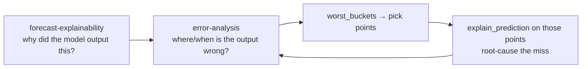

# Error-Analysis Skill

This skill **evaluates forecast accuracy** and **decomposes the error by calendar
variables**. It turns actuals-vs-predictions into the four headline metrics —
**MAE, MAPE, ME, RMSE** — and, for each of them, a **box-plot of the error
distribution** across `year`, `quarter`, `month`, `week`, and `dayofweek`, so you can
see *where* and *when* the forecast breaks down.

It is designed for the Time Series Forecasting Accelerator pipeline, where
**notebook 06** writes `<scenario>_forecasts` with columns `unique_id`, `ds` (date),
`y` (actual), and one or more `y_hat_*` prediction columns (e.g. `y_hat_identity`,
`y_hat_std`), plus a selected best model.

## Run this AFTER `forecast-explainability`

Error analysis answers *"where is the forecast wrong?"*. But a number like "MAE is high
in December" is not actionable on its own — you need to know **why** the model produced
that value. The `forecast-explainability` skill provides that: feature weights (gain /
split) and per-point SHAP contributions.

Recommended flow:



1. First run `forecast-explainability` to understand the model's drivers.
2. Run this skill to quantify accuracy and localize error by calendar bucket.
3. Take the worst buckets (`worst_buckets()`) back to `explain_prediction()` to see
   *which feature weights* produced the miss.

## When To Use

| You want to… | This skill provides |
|--------------|---------------------|
| Score overall accuracy | `metric_summary()` → MAE, MAPE, ME, RMSE (+ WMAPE, sMAPE) |
| Compare model variants | `compare_models()` over all `y_hat_*` columns |
| Break a metric down by season | `metrics_by_calendar(errors, by="month")` |
| See the error *distribution*, not just the mean | `error_boxplot()` / `boxplot_grid()` |
| Find where the model is worst | `worst_buckets()` |
| Produce a stakeholder report | Templates in `templates/` |
| Translate errors into business language | `narrate_errors()` |

## Core Concepts

### Error convention

The module uses the forecasting-standard residual (Hyndman convention):

```
error = y_true - y_pred        # actual minus forecast
```

- `error > 0` → **under-forecast** (actual exceeded the forecast)
- `error < 0` → **over-forecast** (forecast exceeded the actual)
- `ME` (Mean Error / bias) near 0 means the forecast is **unbiased**.

### The four metrics

| Metric | Formula | Reads as | Sensitive to |
|--------|---------|----------|--------------|
| **MAE** | `mean(|error|)` | typical miss size, in target units | — (robust) |
| **MAPE** | `mean(|error| / |y_true|) * 100` | typical miss size, in % | small/zero actuals |
| **ME** | `mean(error)` | direction & size of **bias** | cancellation of +/− |
| **RMSE** | `sqrt(mean(error²))` | miss size, penalizing large errors | outliers / spikes |

MAPE is undefined where `y_true == 0`; those rows are dropped from MAPE only (MAE / ME /
RMSE still use them). `WMAPE` and `sMAPE` are reported as robust alternatives for
intermittent / near-zero series.

### Calendar decomposition & box-plots

Every metric is decomposed across calendar variables (`year`, `quarter`, `month`,
`week`, `dayofweek`). For each variable, `error_boxplot()` shows the **distribution** of
the per-observation error component behind the metric:

| Metric | Per-row column plotted | The box tells you |
|--------|------------------------|-------------------|
| MAE | `abs_error` | magnitude of misses per bucket |
| MAPE | `ape` (%) | relative miss size per bucket |
| ME | `error` (signed) | bias direction & spread (0-line = unbiased) |
| RMSE | `squared_error` | variance of misses (right-skewed — compare, don't read spread) |

A box-plot (not just a bar of the mean) exposes **spread, skew, and outliers** — e.g. a
month with a modest mean MAE but a long upper whisker is driven by a few bad weeks, which
is a different problem than a uniformly poor month.

## Workflow

1. **Assemble actuals vs predictions.** Join `<scenario>_forecasts` to actuals on
   `[unique_id, ds]` so each row has `y` and the chosen `y_hat_*` column.
2. **Compute per-row errors.** `compute_errors(df, y_true="y", y_pred="y_hat_best")`
   returns a tidy frame with `error`, `abs_error`, `squared_error`, `ape` and the
   calendar columns.
3. **Score overall & compare models.** `metric_summary()` for the headline numbers;
   `compare_models()` to rank `y_hat_*` variants.
4. **Decompose by calendar.** `metrics_by_calendar(errors, by="month")` (repeat for
   quarter / week / dayofweek).
5. **Plot distributions.** `error_boxplot(errors, by="month", metric="MAE")` per metric,
   or `boxplot_grid(errors, metric="MAE")` for an at-a-glance page.
6. **Localize & hand off.** `worst_buckets()` picks the worst buckets; feed points from
   them into `explain_prediction()` (the `forecast-explainability` skill).
7. **Narrate.** `narrate_errors()` for prose, then drop it into a report from `templates/`.

## Usage

```python
from evaluate import (
    compute_errors,
    metric_summary,
    compare_models,
    metrics_by_calendar,
    error_boxplot,
    boxplot_grid,
    worst_buckets,
    narrate_errors,
)

# 0) Pick the prediction column (e.g. the best model from notebook 06)
y_pred = best_model_name          # e.g. "y_hat_identity"

# 1) Per-row errors + calendar decomposition columns
errors = compute_errors(forecasts_df, y_true="y", y_pred=y_pred, date_col="ds")

# 2) Headline metrics
print(metric_summary(errors, y_true="y", y_pred=y_pred))

# 3) Compare all model variants
print(compare_models(forecasts_df, y_true="y", sort_by="MAE"))

# 4) Decompose by month, then plot each metric's distribution
print(metrics_by_calendar(errors, by="month", y_pred=y_pred))
for metric in ["MAE", "MAPE", "ME", "RMSE"]:
    error_boxplot(errors, by="month", metric=metric)

# 5) One-page grid (MAE across all calendar variables)
boxplot_grid(errors, metric="MAE")

# 6) Worst buckets → hand off to forecast-explainability
print(worst_buckets(errors, by="month", metric="MAE", top_n=3))

# 7) Narrative
print(narrate_errors(errors, y_true="y", y_pred=y_pred, unit="USD"))
```

## Boundaries

- ✅ Read actuals/forecast tables; compute metrics; decompose by calendar; plot
  distributions; generate narratives. Read-only with respect to data and models.
- ✅ Handle any tidy actuals-vs-predictions frame, and multiple `y_hat_*` columns.
- ⚠️ `matplotlib` is required only for `error_boxplot` / `boxplot_grid`; the metric
  functions have no plotting dependency.
- ⚠️ MAPE / sMAPE are unstable for near-zero actuals (intermittent series) — prefer
  MAE / WMAPE there and say so in the report.
- 🚫 Do not retrain, re-tune, or overwrite models or tables.
- 🚫 Do not assert *causes* of error from this skill alone — confirm the "why" via
  `forecast-explainability` (feature weights / SHAP) before claiming a root cause.

## Files

| File | Purpose |
|------|---------|
| `evaluate.py` | Core functions: per-row errors, MAE/MAPE/ME/RMSE, calendar decomposition, box-plots, worst-bucket ranking, narrative generation. |
| `templates/error_analysis_report.md` | Stakeholder-ready accuracy + error-decomposition report. |
| `templates/example_usage.py` | End-to-end runnable example against the pipeline outputs. |
