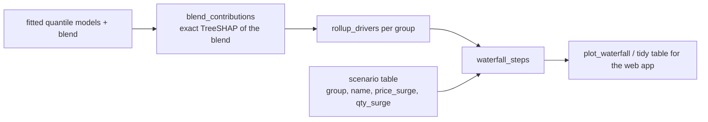

# Forecast-Scenario-Waterfall Skill

Two questions the business asks about a served quarter, answered in **one additive chart**:

1. **Why this number?** The blend `w·q_lo + (1−w)·q_hi` is linear in two LightGBM quantile models and
   TreeSHAP contributions are additive, so the attribution is *exact*: `blend = baseline + Σ contributions`.
   Contributions are rolled up into three drivers the business can read — **recent level** (lag 2–3),
   **last year** (lag 12), **seasonality / calendar** — with the identity features folded into the
   baseline. A **not modelled** bar reconciles to the published number (seasonal-naive series, rule
   lifts) and a **booked actual** bar carries the realised months, so the waterfall ends on the full quarter.
2. **What if the market moves?** The business states a price change and a quantity change per group; the
   factor follows from `revenue = price × quantity`: `(1 + price)(1 + qty)`, applied to the not-yet-booked
   months only. The delta is split into its price and quantity parts (log shares), so the scenario bars are
   **business assumptions, not model output** — drawn hatched and framed to say so.



## Usage

```python
from forecast_scenario_waterfall import blend_contributions, rollup_drivers, waterfall_steps, plot_waterfall, DEFAULT_GROUPS

rows = served[served["is_future"] & (served["profile_cluster"] == "smooth")]      # served, not-yet-booked rows of one cluster
contrib = blend_contributions(final_models["smooth"], committed["smooth"]["blend"], rows, eng.model_features)
drivers = rollup_drivers(contrib, by=rows["product_family"], baseline_features=eng.cats)

row = drivers.set_index("group").loc["HVAC Units"].to_dict()
unbooked = served.loc[served["is_future"] & (served["product_family"] == "HVAC Units"), "forecast_blend"].sum()
booked = served.loc[~served["is_future"] & (served["product_family"] == "HVAC Units"), "forecast_blend"].sum()
steps = waterfall_steps(row, list(DEFAULT_GROUPS), unbooked, booked, "FY26-Q1",
                        scenario={"name": "surge", "price_surge": 0.15, "qty_surge": 0.05})
plot_waterfall(steps, title="HVAC Units - FY26-Q1: what moved the forecast + business surge").show()
```

The tidy `steps` frame (`step_order`, `step`, `measure`, `value`, `running_total`, `is_what_if`, `definition`)
is the chart's data contract for a dashboard or a Delta table; every `total` equals the sum of the bars before it.

## Workflow

1. Take the served frame and the final quantile models from `forecasting-lightgbm-quantile`.
2. Compute contributions per tuned cluster on the **not-yet-booked** rows only; roll up to the business group.
3. Add the not-modelled bar (published − SHAP blend) and the booked actual; check the total equals the published quarter.
4. Read scenarios from a business-owned table (group, name, price_surge, qty_surge); never from widgets with hard-coded upside.
5. Publish the steps table; keep the definitions next to the chart.

## Boundaries

- ✅ Exact for linear blends of LightGBM models; `plotly` only for the figure.
- ⚠️ A rules layer breaks exactness for the lifted rows — that difference lands in `not modelled by SHAP` by design.
- ⚠️ The scenario is arithmetic on the published number; it does not re-run the model. Say so on the chart.
- 🚫 Not a global importance report (use `forecast-explainability`).

## Files

| File | Purpose |
|---|---|
| `forecast_scenario_waterfall.py` | exact blend SHAP, driver roll-up, scenario maths, tidy steps, plotly waterfall |
| `templates/example_usage.py` | end-to-end on the advanced-track served quarter |
| `templates/waterfall_report.md` | report skeleton with the factor definitions |
