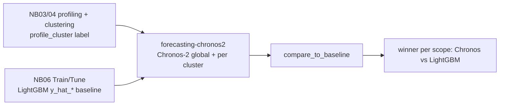

# Chronos-2 Foundation-Model Forecasting Skill

This skill **forecasts time series with a pretrained foundation model** —
**Chronos-2** (`amazon/chronos-2`), a 120M-parameter encoder-only time-series
model that produces **zero-shot** quantile forecasts — and **benchmarks it
against the pipeline's LightGBM baseline**.

Per the request that shaped it, the foundation model is run **twice**:

1. **Globally** — the *entire* panel is passed to Chronos-2 in a single
   `predict_df` call, so the model **cross-learns across all series** via its
   group-attention / in-context-learning mechanism.
2. **By `profile_cluster`** — Chronos-2 is called once per cluster, confining its
   in-context learning to (and specialising it for) each segment.

Both runs are scored on the **same backtest windows** as the LightGBM `y_hat_*`
forecasts from **notebook 06**, so the comparison is apples-to-apples.

It is designed for the Time Series Forecasting Accelerator pipeline, where the
panel has `unique_id` (series id), `ds` (date), `y` (actual value), a
`profile_cluster` grouping column (from notebooks 03/04), and where notebook 06
writes `<scenario>_forecasts` with `y` and one or more `y_hat_*` columns.

## Run this AFTER profiling/clustering and notebook 06

- **Notebooks 03/04** create the `profile_cluster` label used for the per-cluster
  run.
- **Notebook 06** produces the LightGBM `y_hat_*` baseline this skill compares
  against.



## When To Use

| You want to… | This skill provides |
|--------------|---------------------|
| Build the Chronos foundation-model set | `build_models()` |
| Zero-shot forecast over the whole panel | `forecast_global()` |
| Zero-shot forecast per `profile_cluster` | `forecast_by_cluster()` |
| Produce genuine future-horizon forecasts | `predict_future()` |
| Score models with robust metrics | `evaluate_forecasts()` (MAE/RMSE/WMAPE/ME) |
| Pick the winner overall or per cluster | `select_best()` |
| Benchmark vs the LightGBM baseline | `compare_to_baseline()` |
| Summarize the result in prose | `narrate_comparison()` |

## Core Concepts

### The model

| Model | Idea | Notes |
|-------|------|-------|
| **Chronos-2** (`amazon/chronos-2`) | Pretrained encoder-only foundation model; zero-shot multi-step quantile forecasts | Cross-learns across related series via **group attention**; supports univariate, multivariate & covariate tasks; CPU or GPU |
| **Chronos-Bolt** (`amazon/chronos-bolt-*`) | Patch-based, direct multi-step; much faster | Optional extra model for a multi-model comparison |

Add more checkpoints via `build_models(model_names=[...])`. The median (0.5)
quantile is used as the point forecast.

### Zero-shot — no training

Chronos-2 is **pretrained**: it forecasts without any per-series fitting or
tuning. The "backtest" here is pure rolling-origin **inference** — for each
window the model sees history up to the cutoff and predicts the next `h` steps.
There is no `.fit()` and no model artefact to persist.

### Global vs. by-cluster — what actually differs

Unlike classic local models (Croston, ARIMA), Chronos-2 **cross-learns across the
series passed together** in one `predict_df` call. So the two scopes change the
model's **in-context set**, not just the scoring:

- **Global**: every series is in-context for every other → the model borrows
  strength across the whole dataset.
- **By `profile_cluster`**: in-context learning is confined to each cluster →
  useful when clusters have very different dynamics and cross-learning across them
  would be noise.

### Why these metrics

The headline metrics are scale-free / robust so they compare fairly against
LightGBM and stay well-defined on series with zero periods:

| Metric | Formula | Reads as |
|--------|---------|----------|
| **MAE** | `mean(|y - yhat|)` | typical miss size, in target units |
| **RMSE** | `sqrt(mean((y - yhat)²))` | miss size, penalizing spikes |
| **WMAPE** | `sum(|y - yhat|) / sum(|y|) * 100` | error as % of total volume (zero-safe) |
| **ME** | `mean(y - yhat)` | bias: `> 0` under-forecast, `< 0` over-forecast |

Error convention (Hyndman): `error = y - yhat` (actual minus forecast).

### Fair comparison to LightGBM

`compare_to_baseline()` inner-joins the Chronos backtest to the
`<scenario>_forecasts` baseline on `[unique_id, ds]`, so **both families are
scored on the exact same observations**. It labels each model
`Chronos (foundation)` or `LightGBM (baseline)` and returns the winner overall and
(optionally) per cluster.

## Workflow

1. **Confirm inputs.** A panel with `unique_id`, `ds`, `y`, and `profile_cluster`
   (from notebooks 03/04), plus the `<scenario>_forecasts` baseline (notebook 06).
   Confirm the `freq` (e.g. `"MS"` monthly) and horizon `h` with the user, and the
   device (`"auto"` / `"cuda"` / `"cpu"`).
2. **Build models.** `models = build_models()` (Chronos-2) — or add checkpoints.
3. **Global run.** `cv_global = forecast_global(df, h=h, freq="MS", models=models)`.
4. **Per-cluster run.** `cv_cluster = forecast_by_cluster(df, h=h, freq="MS",
   group_col="profile_cluster", models=models)`.
5. **Score & select.** `evaluate_forecasts(...)` then `select_best(...)` overall
   and with `group_by="profile_cluster"`.
6. **Benchmark vs LightGBM.** `compare_to_baseline(cv_global, forecasts_df)` and
   `compare_to_baseline(cv_cluster, forecasts_df, group_by="profile_cluster")`.
7. **Narrate & report.** `narrate_comparison(...)`, then a report from `templates/`.

## Usage

```python
from forecasting_chronos2 import (
    build_models,
    forecast_global,
    forecast_by_cluster,
    evaluate_forecasts,
    select_best,
    compare_to_baseline,
    narrate_comparison,
)

H, FREQ = 3, "MS"                       # horizon + granularity (confirm with user)
models = build_models(device_map="auto")  # Chronos-2 (add checkpoints if desired)

# 1) GLOBAL — entire panel (all series cross-learn)
cv_global = forecast_global(df, h=H, freq=FREQ, models=models, n_windows=3)

# 2) BY profile_cluster — in-context learning confined per cluster
cv_cluster = forecast_by_cluster(
    df, h=H, freq=FREQ, group_col="profile_cluster", models=models, n_windows=3,
)

# 3) Score the Chronos models
print(evaluate_forecasts(cv_global))                                   # overall
print(evaluate_forecasts(cv_cluster, group_by="profile_cluster"))      # per cluster

# 4) Compare to the LightGBM baseline (<scenario>_forecasts has y_hat_* cols)
res_global = compare_to_baseline(cv_global, forecasts_df)
print(res_global["metrics"])            # Chronos vs LightGBM, ranked by MAE
print(res_global["winner"])

res_cluster = compare_to_baseline(cv_cluster, forecasts_df, group_by="profile_cluster")
print(narrate_comparison(res_cluster["metrics"], res_cluster["winner"],
                         unit="units", group_by="profile_cluster"))
```

## Dependencies

- **`chronos-forecasting>=2.0`** (provides `chronos.Chronos2Pipeline`) and
  **`torch`** are required for the forecasting functions and are **not yet** in
  `requirements.txt`. Add them before running:

  ```
  chronos-forecasting>=2.0
  torch>=2.1
  ```

  Flag this as a new dependency at the phase checkpoint before installing. GPU is
  recommended but Chronos-2 also runs on CPU. The pretrained weights
  (`amazon/chronos-2`, ~120M params) download from Hugging Face on first use —
  ensure the runtime has network/model-cache access.
- The **evaluation / narration** helpers (`evaluate_forecasts`, `select_best`,
  `compare_to_baseline`, `narrate_comparison`) use only `numpy` / `pandas` and
  work on any tidy actuals-vs-predictions frame.

## Boundaries

- ✅ Zero-shot forecast with Chronos-2 globally and per `profile_cluster`;
  rolling-origin backtest; score with robust metrics; benchmark vs the LightGBM
  baseline; narrate the result.
- ✅ Handle multiple Chronos checkpoints for a multi-model comparison.
- ⚠️ `chronos-forecasting>=2.0` and `torch` are new dependencies — confirm/install
  first, and confirm model-weight download access.
- ⚠️ "Global vs cluster" changes Chronos-2's *in-context set* (group attention),
  which genuinely alters the forecasts — say so in the report.
- ⚠️ Compare on identical `[unique_id, ds]` windows — `compare_to_baseline()`
  inner-joins to enforce this; if the join is empty the backtest windows differ.
- ⚠️ Assumes a gap-filled panel (notebook 01) so all series share the date grid
  and the rolling cutoffs align across series.
- 🚫 Do not retrain, re-tune, or overwrite the LightGBM models or the
  `<scenario>_forecasts` table — this skill is additive and read-only w.r.t. the
  baseline.
- 🚫 Do not report MAPE on series with zero periods; prefer MAE / WMAPE.

## Files

| File | Purpose |
|------|---------|
| `forecasting_chronos2.py` | Core functions: model catalogue/wrapper, global & per-cluster backtests, future forecasts, metrics, best-model selection, baseline comparison, narrative. |
| `templates/forecasting_chronos2_report.md` | Stakeholder-ready benchmark report (global + per-cluster + vs LightGBM). |
| `templates/example_usage.py` | End-to-end runnable example against the pipeline outputs. |
