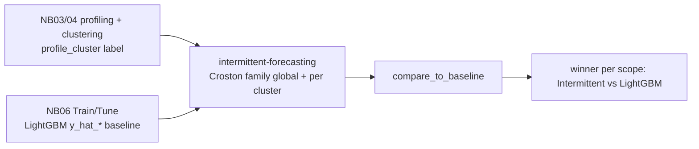

# Intermittent-Forecasting Skill

This skill **forecasts intermittent / lumpy demand** using the classic statistical
models built for series with many zero periods — the **Croston family and its
relatives** — and **benchmarks them against the pipeline's LightGBM baseline**.

Per the request that shaped it, every model is run **twice**:

1. **Globally** — fitted across the *entire* panel in one `StatsForecast` run.
2. **By `profile_cluster`** — fitted separately per cluster so the best
   intermittent model can be picked for each segment.

Both runs are scored on the **same backtest windows** as the LightGBM `y_hat_*`
forecasts from **notebook 06**, so the comparison is apples-to-apples.

It is designed for the Time Series Forecasting Accelerator pipeline, where the
panel has `unique_id` (series id), `ds` (date), `y` (actual demand), a
`profile_cluster` grouping column (from notebooks 03/04), and where notebook 06
writes `<scenario>_forecasts` with `y` and one or more `y_hat_*` columns.

## Run this AFTER profiling/clustering and notebook 06

- **Notebooks 03/04** create the `profile_cluster` label used for the per-cluster
  run. Intermittent models are *most relevant* for series profiled as
  `intermittent`, `lumpy`, `erratic`, or `spikes` — the profiling step is what
  identifies them.
- **Notebook 06** produces the LightGBM `y_hat_*` baseline this skill compares
  against.



## When To Use

| You want to… | This skill provides |
|--------------|---------------------|
| Build the Croston-family model set | `build_models()` |
| Forecast intermittent demand over the whole panel | `forecast_global()` |
| Forecast intermittent demand per `profile_cluster` | `forecast_by_cluster()` |
| Produce genuine future-horizon forecasts | `predict_future()` |
| Score models with intermittent-safe metrics | `evaluate_forecasts()` (MAE/RMSE/WMAPE/ME) |
| Pick the winner overall or per cluster | `select_best()` |
| Benchmark vs the LightGBM baseline | `compare_to_baseline()` |
| Summarize the result in prose | `narrate_comparison()` |

## Core Concepts

### The models

| Model | Idea | Best for |
|-------|------|----------|
| **CrostonClassic** | Separate SES on demand *size* and *inter-demand interval* | General intermittent |
| **CrostonOptimized** | Croston with an optimized smoothing parameter | When α should be data-driven |
| **CrostonSBA** | Syntetos–Boylan Approximation — bias-corrects Croston | Reduces Croston's positive bias |
| **TSB** | Updates demand *probability* every period (not just at demand) | Series that can go obsolete (declining demand) |
| **ADIDA** | Temporal aggregation → forecast → disaggregate | Smooths high intermittence |
| **IMAPA** | Multiple aggregation levels combined | Robustness across interval scales |

Optional `Naive` / `SeasonalNaive` baselines can be added via
`build_models(add_naive_baselines=True)` for context.

### Why these metrics (not MAPE)

Intermittent series contain many zeros, so **MAPE is undefined / unstable**. The
headline metrics here are scale-free or robust:

| Metric | Formula | Reads as |
|--------|---------|----------|
| **MAE** | `mean(|y - yhat|)` | typical miss size, in demand units |
| **RMSE** | `sqrt(mean((y - yhat)²))` | miss size, penalizing spikes |
| **WMAPE** | `sum(|y - yhat|) / sum(|y|) * 100` | error as % of total volume (zero-safe) |
| **ME** | `mean(y - yhat)` | bias: `> 0` under-forecast, `< 0` over-forecast |

Error convention (Hyndman): `error = y - yhat` (actual minus forecast).

### Global vs. by-cluster — what actually differs

Croston-family models are **inherently local** (one fit per series). "Global" and
"by cluster" therefore differ in **scoring and model selection**, not in whether
series are pooled:

- **Global**: all series scored together → one winning intermittent model for the
  whole dataset.
- **By `profile_cluster`**: each cluster scored on its own → the winning
  intermittent model can differ per cluster, which is usually the point (lumpy
  clusters may prefer SBA/TSB; smoother ones may prefer Croston).

### Fair comparison to LightGBM

`compare_to_baseline()` inner-joins the intermittent backtest to the
`<scenario>_forecasts` baseline on `[unique_id, ds]`, so **both families are
scored on the exact same observations**. It labels each model `Intermittent` or
`LightGBM (baseline)` and returns the winner overall and (optionally) per cluster.

## Workflow

1. **Confirm inputs.** A panel with `unique_id`, `ds`, `y`, and `profile_cluster`
   (from notebooks 03/04), plus the `<scenario>_forecasts` baseline (notebook 06).
   Confirm the `freq` (e.g. `"MS"` monthly) and horizon `h` with the user.
2. **Build models.** `models = build_models()` (all Croston-family) — or a subset.
3. **Global run.** `cv_global = forecast_global(df, h=h, freq="MS", models=models)`.
4. **Per-cluster run.** `cv_cluster = forecast_by_cluster(df, h=h, freq="MS",
   group_col="profile_cluster", models=models)`.
5. **Score & select.** `evaluate_forecasts(...)` then `select_best(...)` overall
   and with `group_by="profile_cluster"`.
6. **Benchmark vs LightGBM.** `compare_to_baseline(cv_global, forecasts_df)` and
   `compare_to_baseline(cv_cluster, forecasts_df, group_by="profile_cluster")`.
7. **Narrate & report.** `narrate_comparison(...)`, then a report from `templates/`.

## Usage

```python
from forecast_intermittent import (
    build_models,
    forecast_global,
    forecast_by_cluster,
    evaluate_forecasts,
    select_best,
    compare_to_baseline,
    narrate_comparison,
)

H, FREQ = 3, "MS"                       # horizon + granularity (confirm with user)
models = build_models()                 # CrostonClassic/Optimized/SBA, TSB, ADIDA, IMAPA

# 1) GLOBAL — entire panel
cv_global = forecast_global(df, h=H, freq=FREQ, models=models, n_windows=3)

# 2) BY profile_cluster
cv_cluster = forecast_by_cluster(
    df, h=H, freq=FREQ, group_col="profile_cluster", models=models, n_windows=3,
)

# 3) Score the intermittent models
print(evaluate_forecasts(cv_global))                                   # overall
print(evaluate_forecasts(cv_cluster, group_by="profile_cluster"))      # per cluster

# 4) Compare to the LightGBM baseline (<scenario>_forecasts has y_hat_* cols)
res_global = compare_to_baseline(cv_global, forecasts_df)
print(res_global["metrics"])            # Intermittent vs LightGBM, ranked by MAE
print(res_global["winner"])

res_cluster = compare_to_baseline(cv_cluster, forecasts_df, group_by="profile_cluster")
print(narrate_comparison(res_cluster["metrics"], res_cluster["winner"],
                         unit="units", group_by="profile_cluster"))
```

## Dependencies

- **`statsforecast`** is required for the forecasting functions (Croston family,
  TSB, ADIDA, IMAPA) and is **not yet** in `requirements.txt` (the pipeline ships
  `mlforecast` / `utilsforecast` only). Add it before running:

  ```
  statsforecast>=1.7.0
  ```

  Flag this as a new dependency at the phase checkpoint before installing.
- The **evaluation / narration** helpers (`evaluate_forecasts`, `select_best`,
  `compare_to_baseline`, `narrate_comparison`) use only `numpy` / `pandas` and
  work on any tidy actuals-vs-predictions frame.

## Boundaries

- ✅ Fit Croston-family models globally and per `profile_cluster`; backtest via
  rolling cross-validation; score with intermittent-safe metrics; benchmark vs the
  LightGBM baseline; narrate the result.
- ✅ Handle any subset of the model catalogue and optional naive baselines.
- ⚠️ `statsforecast` is a new dependency — confirm/install it first.
- ⚠️ Intermittent models are inherently local; "global vs cluster" changes scoring
  and selection, not pooling. Say so in the report.
- ⚠️ Compare on identical `[unique_id, ds]` windows — `compare_to_baseline()`
  inner-joins to enforce this; if the join is empty the backtest windows differ.
- 🚫 Do not retrain, re-tune, or overwrite the LightGBM models or the
  `<scenario>_forecasts` table — this skill is additive and read-only w.r.t. the
  baseline.
- 🚫 Do not report MAPE on these series; prefer MAE / WMAPE and explain why.

## Files

| File | Purpose |
|------|---------|
| `forecasting_intermittent.py` | Core functions: model catalogue, global & per-cluster backtests, future forecasts, metrics, best-model selection, baseline comparison, narrative. |
| `templates/forecasting_intermittent_report.md` | Stakeholder-ready benchmark report (global + per-cluster + vs LightGBM). |
| `templates/example_usage.py` | End-to-end runnable example against the pipeline outputs. |
