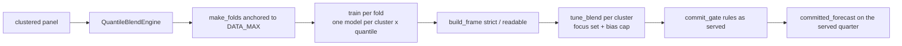

# Forecasting-LightGBM-Quantile Skill

A point model cannot be moved up or down after the fact; a **quantile grid** can. This skill is the
production recipe that came out of a long run of field experiments on a skewed, surge-prone revenue
panel, packaged as `QuantileBlendEngine` plus blend / rules / gate helpers.

| ingredient | lesson it encodes |
|---|---|
| one LightGBM per (cluster, quantile) | the business wants a band and a calibrated point, not a mean |
| `y_lag2`, `y_lag3`, `y_lag12` + fiscal calendar + identity categoricals; **no `lag1`** | at a quarter origin the previous month is unknown for months 2–3; lags beyond the origin fall back to the last actual |
| `SINGLE_SERIES_PARAMS` (num_leaves 3, regularised) vs `POOLED_PARAMS` | big unregularised trees on ~60 rows cross on a large share of quantile pairs and cap the upper band |
| quantile **rearrangement** (sort within row) | removes residual crossings, never hurts pinball loss - a repair, not a substitute for sane trees |
| `tune_blend` on the **revenue-focus** series with a **bias cap** | tiny series add noise; a WMAPE-optimal blend of a lumpy cluster is 30–40 % low |
| `build_frame(mode='strict')` | rows rebuilt exactly as served (extrapolated drivers, origin-consistent lags) - the number production will see |
| `commit_gate` | rules kept only where they beat **both** blend and seasonal naive **as served** - in the readable mode rules grade themselves with the answer key |
| `make_folds` | last *N* complete fiscal quarters + rest-of-quarter served horizon, never hard-coded dates |



## Usage

```python
from forecasting_lightgbm_quantile import (QuantileBlendEngine, make_folds, tune_blend, commit_gate,
                                           committed_forecast, revenue_focus, crossing_rate, oracle_wmape)

eng = QuantileBlendEngine(panel, cluster_col="profile_cluster", tune_clusters=["strategic", "smooth", "erratic"],
                          cats=["product_group", "region", "channel"], fy_start_month=10)
folds = make_folds(eng.data_max, n_val=3, fy_start_month=10)
val = [f for f in folds if not f["future"]]
strict = []
for f in val:
    models = eng.train(f["origin"])
    strict.append(eng.build_frame(f["origin"], f["months"], models, mode="strict"))

focus = revenue_focus(panel, top_share=0.80)
committed = {}
for clu in eng.tune_clusters:
    best = tune_blend(strict, clu, focus=focus, bias_cap=0.15)
    gate = commit_gate(strict, clu, best["blend"], focus=focus)
    committed[clu] = {"method": gate["method"], "blend": best["blend"], "rules": gate["rules"]}
    print(clu, gate["method"], round(best["wmape"], 1), "oracle", round(oracle_wmape(strict, clu, eng.qgrid), 1))

final = eng.train(eng.data_max)
served = committed_forecast(eng.build_frame(eng.data_max, folds[-1]["months"], final, mode="strict"), committed)
```

`eng.train(origin, weight_fn=...)` accepts the `recency-weighting` skill's weight functions; weights are normalised to mean 1 inside.

## Workflow

1. Confirm the cluster column, the identity categoricals and the fiscal year start.
2. Train each validation fold once; build **both** frames (strict for decisions, readable for explanation).
3. Check `crossing_rate` on the raw single-series cluster; if high, shrink trees before anything else.
4. Tune the blend per cluster on the focus set; compare with `oracle_wmape` - a small gap means tuning is done.
5. Run the commit gate; rules whose readable score is good and strict score is bad are firing on extrapolated trends - leave them off.
6. Retrain on all data through `data_max`, serve the rest of the quarter; booked months carry actuals.
7. Hand the strict frames to `scaled-accuracy-metrics` and the served frame to `aggregate-anchor-reconciliation`.

## Boundaries

- ✅ Any monthly panel with a cluster label; `lightgbm` required for training (already in `requirements.txt`).
- ⚠️ Trees cannot extrapolate above the training range: a steep sustained surge stays under-forecast whatever the blend. Use `recency-weighting` (gated) and `aggregate-anchor-reconciliation`, or a different model family.
- ⚠️ Rules drivers (`price_qoq`, `qty_qoq`) are **not** model features by design; they only gate the rule.
- 🚫 Does not touch notebook 06's `mlforecast` baseline; writes its own `_quantile_forecasts` / `_quantile_config`.

## Files

| File | Purpose |
|---|---|
| `forecasting_lightgbm_quantile.py` | engine (features, folds, training, as-served rows, prediction), blend / rules / tuning / gate |
| `templates/example_usage.py` | compact end-to-end run on the advanced-track clustered panel |
| `templates/quantile_blend_report.md` | model-card skeleton (recipe per cluster, gate table, crossing, oracle) |
