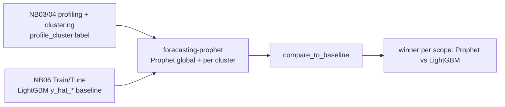

# Prophet Forecasting Skill

This skill **forecasts time series with Prophet** — Meta/Facebook's decomposable
additive model (**trend + seasonality + holidays**) that is robust to missing data
and trend shifts — and **benchmarks it against the pipeline's LightGBM baseline**.

Per the request that shaped it, Prophet is run **twice**:

1. **Globally** — a Prophet model is fitted per series across the *entire* panel in a
   single `forecast_global` run; selection and scoring are pooled across all series,
   yielding one winning Prophet configuration for the whole dataset.
2. **By `profile_cluster`** — Prophet is backtested once per cluster
   (`forecast_by_cluster`), so the best Prophet configuration can be picked for each
   segment.

Both runs are scored on the **same backtest windows** as the LightGBM `y_hat_*`
forecasts from **notebook 06**, so the comparison is apples-to-apples.

It is designed for the Time Series Forecasting Accelerator pipeline, where the panel
has `unique_id` (series id), `ds` (date), `y` (actual value), a `profile_cluster`
grouping column (from notebooks 03/04), and where notebook 06 writes
`<scenario>_forecasts` with `y` and one or more `y_hat_*` columns.

## Run this AFTER profiling/clustering and notebook 06

- **Notebooks 03/04** create the `profile_cluster` label used for the per-cluster
  run.
- **Notebook 06** produces the LightGBM `y_hat_*` baseline this skill compares
  against.



## When To Use

| You want to… | This skill provides |
|--------------|---------------------|
| Build the Prophet configuration set | `build_models()` |
| Forecast with Prophet over the whole panel | `forecast_global()` |
| Forecast with Prophet per `profile_cluster` | `forecast_by_cluster()` |
| Produce genuine future-horizon forecasts | `predict_future()` |
| Score models with robust metrics | `evaluate_forecasts()` (MAE/RMSE/WMAPE/ME) |
| Pick the winner overall or per cluster | `select_best()` |
| Benchmark vs the LightGBM baseline | `compare_to_baseline()` |
| Summarize the result in prose | `narrate_comparison()` |

## Core Concepts

### The models

Each "model" is a named **Prophet configuration** (a set of constructor kwargs):

| Model | Idea | Best for |
|-------|------|----------|
| **Prophet** | Default additive Prophet (auto seasonality) | General-purpose baseline |
| **Prophet_Mult** | `seasonality_mode="multiplicative"` | Seasonality that grows with the level |
| **Prophet_Flexible** | High `changepoint_prior_scale` (0.5) | Series with frequent trend shifts |
| **Prophet_Smooth** | Low `changepoint_prior_scale` (0.01) | Stable, slow-moving trends |
| **Prophet_Yearly** | Yearly seasonality forced on; weekly/daily off | Strong annual cycles (e.g. monthly revenue) |

Add custom configurations (holidays, extra seasonalities) via
`build_models(extra={"Prophet_Holidays": {...}})`. The `yhat` column is the point
forecast.

### Prophet is a local model

Prophet fits **one model per series** — there is no cross-series pooling. "Global vs
cluster" therefore changes **scoring and model selection** (and, if you supply
per-cluster configurations, which hyperparameters are used), not whether series
share a fit:

- **Global**: all series scored together → one winning Prophet configuration for the
  whole dataset.
- **By `profile_cluster`**: each cluster scored on its own → the winning Prophet
  configuration can differ per cluster (flexible-trend clusters may prefer
  `Prophet_Flexible`; stable ones may prefer `Prophet_Smooth`).

### Why these metrics

The headline metrics are scale-free / robust so they compare fairly against LightGBM
and stay well-defined on series with zero periods:

| Metric | Formula | Reads as |
|--------|---------|----------|
| **MAE** | `mean(|y - yhat|)` | typical miss size, in target units |
| **RMSE** | `sqrt(mean((y - yhat)²))` | miss size, penalizing spikes |
| **WMAPE** | `sum(|y - yhat|) / sum(|y|) * 100` | error as % of total volume (zero-safe) |
| **ME** | `mean(y - yhat)` | bias: `> 0` under-forecast, `< 0` over-forecast |

Error convention (Hyndman): `error = y - yhat` (actual minus forecast).

### Fair comparison to LightGBM

`compare_to_baseline()` inner-joins the Prophet backtest to the
`<scenario>_forecasts` baseline on `[unique_id, ds]`, so **both families are scored
on the exact same observations**. It labels each model `Prophet` or
`LightGBM (baseline)` and returns the winner overall and (optionally) per cluster.

## Workflow

1. **Confirm inputs.** A panel with `unique_id`, `ds`, `y`, and `profile_cluster`
   (from notebooks 03/04), plus the `<scenario>_forecasts` baseline (notebook 06).
   Confirm the `freq` (e.g. `"MS"` monthly) and horizon `h` with the user.
2. **Build models.** `models = build_models()` (all Prophet configs) — or a subset.
3. **Global run.** `cv_global = forecast_global(df, h=h, freq="MS", models=models)`.
4. **Per-cluster run.** `cv_cluster = forecast_by_cluster(df, h=h, freq="MS",
   group_col="profile_cluster", models=models)`.
5. **Score & select.** `evaluate_forecasts(...)` then `select_best(...)` overall and
   with `group_by="profile_cluster"`.
6. **Benchmark vs LightGBM.** `compare_to_baseline(cv_global, forecasts_df)` and
   `compare_to_baseline(cv_cluster, forecasts_df, group_by="profile_cluster")`.
7. **Narrate & report.** `narrate_comparison(...)`, then a report from `templates/`.

## Usage

```python
from forecasting_prophet import (
    build_models,
    forecast_global,
    forecast_by_cluster,
    evaluate_forecasts,
    select_best,
    compare_to_baseline,
    narrate_comparison,
)

H, FREQ = 3, "MS"                       # horizon + granularity (confirm with user)
models = build_models()                 # Prophet, _Mult, _Flexible, _Smooth, _Yearly

# 1) GLOBAL — entire panel (one Prophet fit per series)
cv_global = forecast_global(df, h=H, freq=FREQ, models=models, n_windows=3)

# 2) BY profile_cluster
cv_cluster = forecast_by_cluster(
    df, h=H, freq=FREQ, group_col="profile_cluster", models=models, n_windows=3,
)

# 3) Score the Prophet models
print(evaluate_forecasts(cv_global))                                   # overall
print(evaluate_forecasts(cv_cluster, group_by="profile_cluster"))      # per cluster

# 4) Compare to the LightGBM baseline (<scenario>_forecasts has y_hat_* cols)
res_global = compare_to_baseline(cv_global, forecasts_df)
print(res_global["metrics"])            # Prophet vs LightGBM, ranked by MAE
print(res_global["winner"])

res_cluster = compare_to_baseline(cv_cluster, forecasts_df, group_by="profile_cluster")
print(narrate_comparison(res_cluster["metrics"], res_cluster["winner"],
                         unit="units", group_by="profile_cluster"))
```

## Dependencies

- **`prophet>=1.1`** is required for the forecasting functions and is **not yet** in
  `requirements.txt` (the pipeline ships `mlforecast` / `utilsforecast` only). Add it
  before running:

  ```
  prophet>=1.1
  ```

  Flag this as a new dependency at the phase checkpoint before installing. Prophet
  pulls in `cmdstanpy` and compiles a Stan model on first import — ensure the runtime
  allows this (a first-run compile / model download may occur).
- The **evaluation / narration** helpers (`evaluate_forecasts`, `select_best`,
  `compare_to_baseline`, `narrate_comparison`) use only `numpy` / `pandas` and work
  on any tidy actuals-vs-predictions frame.

## Boundaries

- ✅ Fit Prophet globally and per `profile_cluster`; rolling-origin backtest; score
  with robust metrics; benchmark vs the LightGBM baseline; narrate the result.
- ✅ Handle any subset of the Prophet configuration catalogue plus custom configs
  (holidays, extra seasonalities) via `build_models(extra=...)`.
- ⚠️ `prophet` is a new dependency — confirm/install it first (it compiles a Stan
  backend on first use).
- ⚠️ Prophet is inherently local (one fit per series); "global vs cluster" changes
  *scoring & selection*, not pooling. Say so in the report.
- ⚠️ Prophet fits one model per series per window, so a large panel × many windows ×
  several configs can be slow — subset the configs or reduce `n_windows` if needed.
- ⚠️ Compare on identical `[unique_id, ds]` windows — `compare_to_baseline()`
  inner-joins to enforce this; if the join is empty the backtest windows differ.
- ⚠️ Assumes a gap-filled panel (notebook 01) so all series share the date grid and
  the rolling cutoffs align across series.
- 🚫 Do not retrain, re-tune, or overwrite the LightGBM models or the
  `<scenario>_forecasts` table — this skill is additive and read-only w.r.t. the
  baseline.
- 🚫 Do not report MAPE on series with zero periods; prefer MAE / WMAPE.

## Files

| File | Purpose |
|------|---------|
| `forecasting_prophet.py` | Core functions: model catalogue, global & per-cluster backtests, future forecasts, metrics, best-model selection, baseline comparison, narrative. |
| `templates/forecasting_prophet_report.md` | Stakeholder-ready benchmark report (global + per-cluster + vs LightGBM). |
| `templates/example_usage.py` | End-to-end runnable example against the pipeline outputs. |
