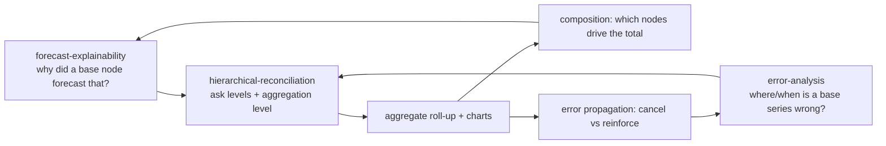

# Hierarchical-Reconciliation Skill

This skill **reconciles base (bottom-level) forecasts up a hierarchy you define**, charts
the roll-up, and answers two questions that only make sense in aggregate:

1. **How does the forecast result in the aggregate?** — which nodes compose the total, and
   (via `forecast-explainability`) which feature weights drove those base forecasts.
2. **Where are the errors, and how do they propagate?** — which nodes drive the aggregate
   miss, and whether base errors **cancel** (diversify) or **reinforce** (systematic bias)
   as they roll up (via `error-analysis`).

It is designed for the Time Series Forecasting Accelerator pipeline, where **notebook 06**
writes `<scenario>_forecasts` with `unique_id` (the base series), `ds` (date), `y`
(actual) and one or more `y_hat_*` prediction columns. The **hierarchy levels** are the
static attribute columns that locate each base series (e.g. `region`, `segment`,
`product_family`, `unique_id`).

## Step 0 (required): ask the data scientist to define the hierarchy

**Before reconciling anything, ask the user two questions and confirm the answer with
`describe_hierarchy()`:**

1. **Which columns are the hierarchical levels, ordered from top (coarsest) to bottom
   (finest)?** e.g. `["region", "segment", "product_family", "unique_id"]`. The finest
   level is normally the base series `unique_id`.
2. **At which level do you want to aggregate / reconcile?** e.g. `region`, or `Total` for
   the grand total. This is the `level` passed to the aggregation and chart functions.

Then run `describe_hierarchy(df, levels)` and `validate_hierarchy(df, levels)` and show the
node counts / nesting back to the user for confirmation. Do not proceed until the levels
and target level are confirmed — the whole analysis depends on them.

## Run this AFTER `forecast-explainability` and `error-analysis`



- Composition points back to `forecast-explainability`: run `explain_prediction` on the
  **dominant nodes** to see the feature weights behind the base forecast that moves the total.
- Error propagation points back to `error-analysis`: run `compute_errors` / `worst_buckets`
  on the **driver nodes** to see *when* they miss.

## When To Use

| You want to… | This skill provides |
|--------------|---------------------|
| Define & sanity-check a hierarchy | `describe_hierarchy()`, `validate_hierarchy()` |
| Roll base forecasts up to a level | `aggregate_to_level()`, `bottom_up()` |
| See which nodes build the aggregate | `level_contributions()`, `plot_contribution_bars()`, `plot_waterfall()` |
| Chart aggregate fit over time | `plot_aggregate_actual_vs_forecast()`, `plot_level_contributions()`, `reconciliation_grid()` |
| Measure error at each level | `error_by_level()`, `plot_error_by_level()` |
| See which nodes drive aggregate error | `error_contribution()`, `plot_error_propagation()` |
| Quantify error cancellation on roll-up | `error_cancellation()` |
| Check coherence of a direct aggregate model | `coherence_gap()` |
| Explain findings in prose | `narrate_hierarchy()`, `narrate_reconciliation()`, `narrate_error_propagation()` |

## Core Concepts

### Hierarchy & bottom-up reconciliation

`levels` is an ordered list from **top (coarsest) → bottom (finest)**. The pipeline
produces per-series base forecasts, so aggregation is **bottom-up**: an aggregate node's
forecast is the sum of its children's base forecasts. Bottom-up is *coherent by
construction* (children always sum to the parent), so this skill focuses on **composition**
and **error propagation** rather than reconciliation weights. If a level was forecast
*directly* by a separate model, `coherence_gap()` measures the disagreement.

### Composition — how the forecast results in the aggregate

The aggregate forecast is a sum, so a few large nodes usually dominate. `level_contributions()`
gives the Pareto (share and cumulative share); `plot_waterfall()` shows, for one period,
each node's forecast stacking up to the total. These identify the nodes worth explaining
with `forecast-explainability`.

### Error propagation — where errors are and how they roll up

Because aggregation sums signed errors, base errors interact:

| Behaviour | Signature | Meaning |
|-----------|-----------|---------|
| **Cancellation (diversification)** | aggregate MAPE/WMAPE **falls** vs base; high `cancellation_pct` | base misses are largely noise that averages out — the aggregate is *more* reliable than the base |
| **Reinforcement (systematic bias)** | aggregate `ME` stays large; low `cancellation_pct` | base errors are correlated/biased and propagate straight up — the aggregate inherits the bias |

`error_by_level()` shows the metric curve up the hierarchy; `error_cancellation()`
quantifies the % of gross base error that cancels at each level; `error_contribution()`
and `plot_error_propagation()` show the **signed** contribution of each node to the net
aggregate error (green = under-forecast, red = over-forecast).

## Workflow

1. **Ask & confirm the hierarchy (Step 0).** Get the ordered `levels` and the target
   `level` from the user; confirm with `describe_hierarchy()` / `validate_hierarchy()`.
2. **Assemble base actuals vs predictions.** Join `<scenario>_forecasts` to actuals on
   `[unique_id, ds]`; ensure the hierarchy columns are present on each base row (they are
   static per `unique_id`).
3. **Aggregate.** `aggregate_to_level(df, levels, level)` for the target level, or
   `bottom_up(df, levels)` for every level at once.
4. **Chart composition.** `plot_aggregate_actual_vs_forecast()`,
   `plot_level_contributions()`, `plot_contribution_bars()`, `plot_waterfall()`,
   `reconciliation_grid()`. **Always explain each chart** with `narrate_reconciliation()`.
5. **Chart & measure error propagation.** `error_by_level()` + `plot_error_by_level()`;
   `error_cancellation()`; `error_contribution()` + `plot_error_propagation()`. Explain
   with `narrate_error_propagation()`.
6. **Hand off.** Dominant nodes → `forecast-explainability`; driver / worst nodes →
   `error-analysis`.

## Usage

```python
from reconcile import (
    describe_hierarchy, validate_hierarchy,
    aggregate_to_level, bottom_up, level_contributions,
    error_by_level, error_contribution, error_cancellation,
    plot_hierarchy_tree, plot_aggregate_actual_vs_forecast,
    plot_level_contributions, plot_contribution_bars, plot_waterfall,
    plot_error_by_level, plot_error_propagation, reconciliation_grid,
    narrate_hierarchy, narrate_reconciliation, narrate_error_propagation,
)

# STEP 0 — ask the user, then confirm the hierarchy
levels = ["region", "segment", "unique_id"]   # top → bottom (from the user)
target_level = "region"                        # aggregation level (from the user)
print(describe_hierarchy(forecasts_df, levels))
print(validate_hierarchy(forecasts_df, levels))
print(narrate_hierarchy(forecasts_df, levels, target_level))

# Choose the prediction column (best model from notebook 06)
y_pred = best_model_name                        # e.g. "y_hat_identity"

# 1) Composition — how base forecasts build the aggregate
agg = aggregate_to_level(forecasts_df, levels, target_level, y_pred=y_pred)
plot_aggregate_actual_vs_forecast(forecasts_df, levels, target_level, y_pred=y_pred)
plot_level_contributions(forecasts_df, levels, target_level, y_pred=y_pred)
plot_contribution_bars(forecasts_df, levels, target_level, y_pred=y_pred)
last_period = forecasts_df["ds"].max()
plot_waterfall(forecasts_df, levels, target_level, period=last_period, y_pred=y_pred)
print(narrate_reconciliation(forecasts_df, levels, target_level, y_pred=y_pred, unit="USD"))

# 2) Error propagation — where errors are and how they roll up
print(error_by_level(forecasts_df, levels, y_pred=y_pred))
print(error_cancellation(forecasts_df, levels, y_pred=y_pred))
plot_error_by_level(forecasts_df, levels, y_pred=y_pred)
plot_error_propagation(forecasts_df, levels, target_level, y_pred=y_pred)
print(narrate_error_propagation(forecasts_df, levels, target_level, y_pred=y_pred, unit="USD"))
```

## Boundaries

- ✅ Read actuals/forecast tables; define & validate a hierarchy; aggregate bottom-up;
  chart composition and error propagation; generate narratives. Read-only w.r.t. data and models.
- ✅ Handle any tidy actuals-vs-predictions frame that carries the hierarchy columns, and
  any number of levels (including a single level or the grand `Total`).
- ⚠️ **Always ask for the levels and the target aggregation level first** (Step 0) and
  confirm with `describe_hierarchy()` — never assume them.
- ⚠️ `matplotlib` is required only for the `plot_*` / `reconciliation_grid` helpers; the
  aggregation and metric functions have no plotting dependency.
- ⚠️ Bottom-up is coherent by construction; only use `coherence_gap()` when a *separate*
  direct aggregate forecast exists. This skill does not implement optimal (MinT)
  reconciliation — flag it as a follow-up if a direct model disagrees materially.
- ⚠️ MAPE is unstable for near-zero aggregates; prefer WMAPE and say so in the report.
- 🚫 Do not retrain, re-tune, or overwrite models or tables.
- 🚫 Do not assert *causes* of an aggregate move or miss from this skill alone — confirm
  the "why" of the driving nodes via `forecast-explainability` (feature weights / SHAP) and
  their *when* via `error-analysis` before claiming a root cause. **Always explain findings.**

## Files

| File | Purpose |
|------|---------|
| `reconcile.py` | Core functions: hierarchy intake/validation, bottom-up aggregation, composition, error-by-level and error-propagation, cancellation, coherence, charts, narratives. |
| `templates/hierarchical_reconciliation_report.md` | Stakeholder-ready reconciliation + error-propagation report. |
| `templates/example_usage.py` | End-to-end runnable example against the pipeline outputs. |
