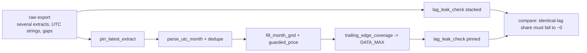

# Panel-Prep-Leak-Guards Skill

The most expensive bug in the field was not a modelling bug: a table that accumulated **one data extract per
pipeline run** was read whole, so every series-month appeared several times. Lags computed on that stack saw
the *current* month as "lag 2", growth rates collapsed to zero, and the backtest looked unjustifiably good.
This skill is the preparation recipe with the guards that catch that class of problem.

| guard | problem it catches |
|---|---|
| `pin_latest_extract` | several extracts stacked in one table → pick exactly one (Job-provided id or the newest) **before** any feature |
| `parse_utc_month` | `'2025-09-01T00:00:00Z'` parses tz-aware; naive comparisons raise or drop the last month |
| `dedupe_series_month` | revisions inside one extract |
| `fill_month_grid` | absent months are zeros - the intermittent profile depends on them |
| `guarded_price` | revenue / 0 (credit notes, installation-only months) must be `NaN`, never `inf` |
| `trailing_edge_coverage` | late bookings thin the newest months; after gap filling they look like a collapse → decide `DATA_MAX` explicitly |
| `lag_leak_check` | the measurable symptom: share of rows where "lag k" equals the current value, and inflated `corr(y, lag k)` |



## Usage

```python
from panel_prep_leak_guards import prepare_panel, lag_leak_check

panel, report = prepare_panel(raw, id_col="unique_id", date_col="period_start_utc", target="net_revenue_usd",
                              qty_col="units_shipped", orders_col="order_count", extract_col="extract_id", ts_col="extract_ts",
                              min_coverage=0.90)
print(report["extract_used"], "of", report["n_extracts"], "extracts | data through", report["data_max"].date())
print("leak check  stacked:", report["leak_check_stacked"])     # share_identical far above 0 -> the stack leaks
print("leak check  pinned :", report["leak_check_pinned"])      # ~0.0
print("trailing edge:", report["trailing_edge"]["drop_months"])
```

## Workflow

1. Never read a multi-extract table whole; pin first, then build features.
2. Parse timestamps as UTC and drop the timezone; normalise to month start.
3. Fill the grid for the whole history (zeros), keep `price_per_unit` guarded.
4. Print the coverage of the last 3 months vs the steady state; drop a thin trailing month deliberately (and say so) rather than training on false zeros.
5. Keep the two leak-check numbers in the run log: on the pinned panel the identical-lag share must be ~0.

## Boundaries

- ✅ pandas / numpy only; works on Spark-to-pandas frames or parquet.
- ⚠️ `min_coverage` is a judgement: 0.90 suits late-booking businesses; tighten it where postings are prompt.
- 🚫 Does not replace notebook 01's domain-specific cleaning; it adds the guards around it.

## Files

| File | Purpose |
|---|---|
| `panel_prep_leak_guards.py` | the guards + `prepare_panel` one-call recipe |
| `templates/example_usage.py` | run on the synthetic raw export (notebook 07) |
| `templates/prep_report.md` | report skeleton (extract, coverage, leak check) |
