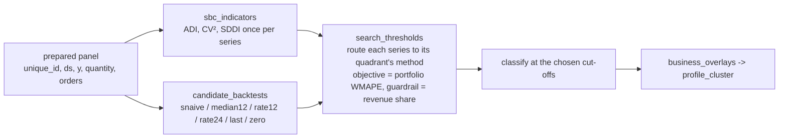

# Profiling-Threshold-Search Skill

Notebook 03 labels series with the textbook SBC cut-offs. Those were derived for retail units; on a
durable-goods revenue panel (project deals, spare parts, service contracts) they are a guess. This skill
makes the thresholds a **decision with an objective and a guardrail**.



## Why a *routing* objective

Scoring one model on one group leaves the CV² threshold unidentified (the group's error barely moves
when series shuffle between `smooth` and `erratic`). The classification exists to **pick a method family
per series**, so the objective must be the portfolio error *under that routing*: `smooth → seasonal naive`,
`erratic → robust 12-month median`, `intermittent → 12-month demand rate`, `lumpy → 24-month demand rate`,
`constant → last`, `constant_zero → zero`. Both thresholds then matter, and the per-series oracle (best
method per series) gives the floor.

## Why a guardrail

The unconstrained optimum often drifts to "call almost everything sparse" because flat demand rates score
well on a short hold-out. `min_revenue_share` / `min_series` force the regular group - the one the quantile
models will serve - to keep a business-meaningful share of revenue. Read the minimum *to the right of* the
guardrail line, never the global minimum.

## Usage

```python
from profiling_threshold_search import (sbc_indicators, candidate_backtests, search_thresholds, classify,
                                        business_overlays, narrate_search)

ind = sbc_indicators(panel, size_col="quantity", occurrence_col="orders")
bt = candidate_backtests(panel, target="y", horizon=6, season=12)
rev = panel.groupby("unique_id")["y"].sum()
results, best = search_thresholds(ind, bt, rev, n_iter=60, min_revenue_share=0.40, min_series=40)
print(narrate_search(results, best))

ind["profile"] = classify(ind, best["thres_cv2"], best["thres_adi"])
clusters = business_overlays(panel, ind.set_index("unique_id")["profile"], strategic_min_share=0.08, recent_months=12)
print(clusters["profile_cluster"].value_counts())
```

## Workflow

1. Confirm the panel is gap-filled (zero rows for inactive months) - ADI depends on it.
2. Decide what drives the pattern: sizes from `quantity`, occurrences from `orders`; score on `y`.
3. Run the search with the textbook pair as trial 0; keep the landscape (`results`) for the review.
4. Set the guardrail with the business ("how much revenue must be modelled as regular demand?").
5. Apply the overlays; `strategic` and the regular profiles feed `forecasting-lightgbm-quantile`;
   `intermittent` / `lumpy` go to `forecasting-intermittent`; the rest default to the seasonal naive.
6. On synthetic data, compare `profile` with the generator's archetype to calibrate expectations
   (the ADI side is recovered almost perfectly; `smooth ↔ erratic` swaps are common).

## Boundaries

- ✅ numpy / pandas only; works per scenario on any monthly / weekly panel.
- ⚠️ The simple methods are deliberately crude; do not replace them with the production model or the
  thresholds will be tuned to that model's quirks.
- ⚠️ Horizon 6 is short; the search is a *relative* judgement between threshold pairs, not an accuracy claim.
- 🚫 Does not overwrite notebook 03's output; writes its own `profile` / `profile_cluster`.

## Files

| File | Purpose |
|---|---|
| `profiling_threshold_search.py` | indicators, candidate backtests, routing search with guardrail, overlays, narrative |
| `templates/example_usage.py` | end-to-end run on the advanced-track prepared panel |
| `templates/profiling_threshold_report.md` | review template (landscape, quadrants, overlays) |
