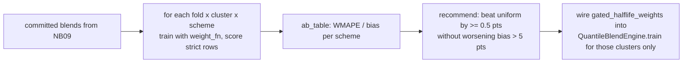

# Recency-Weighting Skill

Gradient-boosted trees cannot predict above the range they were trained on, and a model fitted on five
years anchors its quantiles to the old level. The cheapest lever is **half-life sample weighting**
`w = 0.5^(months_ago / halflife)`. This skill makes that lever safe:

| lesson | mechanism |
|---|---|
| recency helps **sustained step-ups**, hurts seasonal and spiky series | A/B per cluster **and** per series; `recommend` keeps `uniform` unless a scheme wins under a bias guard |
| a hard window is worse than a soft half-life | `window_weights` is kept as the anti-pattern to compare against |
| the raw surge size does not predict the benefit | `surge_flags`: recent-6 ≥ `ratio` × prior-year **and** recent-3 ≥ 0.8 × recent-6 (a spike that reverted does not qualify) |
| quantile objective + raw-scale weights = garbage | every function returns weights normalised to mean 1 |



## Usage

```python
from recency_weighting import make_weight_fn, surge_flags, ab_table, recommend, narrate
from forecasting_lightgbm_quantile import QuantileBlendEngine, make_folds, apply_blend, wmape, bias_pct

eng = QuantileBlendEngine(panel, fy_start_month=10, qgrid=[0.4, 0.5, 0.7, 0.8, 0.9])
folds = [f for f in make_folds(eng.data_max, 3, 10) if not f["future"]]
results = []
for clu in eng.tune_clusters:
    for scheme in ["uniform", "hl6", "hl9", "window18", "hl9_gated"]:
        frames = []
        for f in folds:
            models = eng.train(f["origin"], weight_fn=make_weight_fn(scheme))
            frames.append(apply_blend(eng.build_frame(f["origin"], f["months"], {clu: models[clu]}, "strict"), committed[clu]["blend"]))
        s = pd.concat(frames)
        s = s[s["has_actual"]]
        results.append({"cluster": clu, "scheme": scheme, "wmape": wmape(s["y"], s["yhat_blend"]), "bias_pct": bias_pct(s["y"], s["yhat_blend"])})
ab = ab_table(results)
print(narrate(recommend(ab)))

# which series would the gate flag at the served origin?
flags = surge_flags(eng.feat[eng.feat["ds"] <= eng.data_max], eng.data_max)
```

## Workflow

1. Freeze the blends to the committed recipe so the A/B isolates the weights.
2. Run the schemes per cluster on the **strict** frames pooled over the folds; report WMAPE **and** bias.
3. Per series, plot `hl9 − uniform` against the surge ratio; sustained step-ups sit right-and-below, spikes right-and-above.
4. Adopt per cluster (`recommend`), never globally. Wire the gated function into the engine for those clusters only.
5. The gate re-evaluates itself at every origin from history ≤ origin, so a series drops out once its step-up reverts.

## Boundaries

- ✅ numpy / pandas only; the training happens in `forecasting-lightgbm-quantile`.
- ⚠️ If a cluster still under-forecasts a steep surge after recency, the cause is the tree ceiling, not the weights - use `aggregate-anchor-reconciliation` or an extrapolating model family.
- ⚠️ On a panel where the step-up starts *after* the validation origins the A/B will (correctly) reject recency; say so rather than forcing it.
- 🚫 Do not blanket-apply a half-life to spiky / seasonal clusters.

## Files

| File | Purpose |
|---|---|
| `recency_weighting.py` | weight functions (half-life, window, gated), surge gate, A/B table, recommendation, narrative |
| `templates/example_usage.py` | compact A/B on the advanced-track panel |
| `templates/recency_ab_report.md` | report skeleton |
