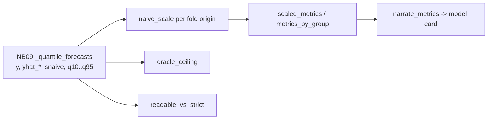

# Scaled-Accuracy-Metrics Skill

Three questions, three metrics - and the discipline to report them together:

| question | metric | reads as |
|---|---|---|
| how many currency units off? | **WMAPE** = Σ\|a−p\| / Σ\|a\| | pooled error, zero-safe, errors never cancel - the gate metric |
| net over or under? | **bias %** = Σ(p−a) / Σ\|a\| | a WMAPE-optimal blend of a lumpy cluster is often 30–40 % *low*; invisible without this column |
| did the model beat the dumbest forecast for *this* series? | **MASE** = per-series MAE ÷ mean \|one-step change\| of its training history | `< 1` beats one-step naive; the denominator is the series' own volatility, so a timing miss on a spiky series is not double-punished |

MASE is summarised as the **median** across series (the typical series) and **revenue-weighted** (`wmase`, the big series). Never the plain mean: a near-zero series posts a MASE in the thousands and drowns the cluster.

Two diagnostics come with it:

- **Oracle ceiling** - the WMAPE of the per-row *best* quantile. No blend or rule layer can beat it; when the committed forecast is within a few points of it, stop tuning and change the model family or the aggregation level.
- **Readable vs strict** - validation rows that carry the month's *actual* drivers and realised lags versus rows rebuilt exactly as served. A forecast that looks much better in the readable mode is grading itself with the answer key. Quote the strict number.



## Usage

```python
from scaled_accuracy_metrics import (naive_scale, scaled_metrics, metrics_by_group,
                                     oracle_ceiling, readable_vs_strict, narrate_metrics)

fold = forecasts[forecasts["fold"] == "fold2"]                 # one validation fold, strict rows
scales = naive_scale(panel, origin=fold["origin"].iloc[0])     # leak-free denominators
table = metrics_by_group(fold, pred_cols=["yhat_committed", "snaive"],
                         group_cols=["profile_cluster"], scales=scales)
print(table[["profile_cluster", "forecast", "wmape", "bias_pct", "mase_med", "wmase"]])

print(oracle_ceiling(fold, [f"q{q}" for q in (10, 20, 30, 40, 50, 60, 70, 80, 90, 95)]))
print(narrate_metrics(table, group_col="profile_cluster", forecast="yhat_committed"))
```

## Workflow

1. Take the forecast table with actuals (`y`), one or more forecast columns and the fold `origin`.
2. Compute `naive_scale` **per origin** (history ≤ origin only) - the denominator must never see the scored months.
3. `metrics_by_group` per cluster × quarter, then pooled (`ALL`). Put WMAPE, bias and median MASE side by side.
4. `oracle_ceiling` on the quantile columns: if `committed − oracle` is small, tuning is done.
5. If both validation modes exist, `readable_vs_strict`; a gap of more than a few points on a forecast column means it depends on information that will not exist at serve time.
6. `narrate_metrics` for the model card.

## Boundaries

- ✅ Any tidy actuals-vs-predictions frame; no model dependency (numpy / pandas only).
- ⚠️ MASE here uses the **one-step** naive denominator (monthly diff), not the seasonal one; say so when comparing with other reports.
- ⚠️ Do not rank clusters against each other on MASE - a spiky cluster has a forgiving denominator. Rank on WMAPE; use MASE to answer "is the model adding skill?".
- 🚫 Do not report the mean MASE; do not report MAPE on intermittent series.

## Files

| File | Purpose |
|---|---|
| `scaled_accuracy_metrics.py` | metrics, oracle ceiling, readable-vs-strict, narrative |
| `templates/example_usage.py` | end-to-end example on the advanced-track tables |
| `templates/scaled_accuracy_report.md` | report skeleton for the model card |
