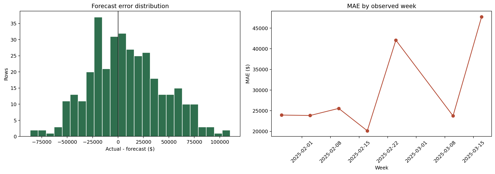

# Error Analysis - supermarket_net_sales_forecast

_Phase 6, Step 2. Computed from the existing Notebook 06 walk-forward predictions; no model was trained, tuned, or modified._

## Approved scope

| Attribute | Value |
|---|---|
| Prediction | `y_hat_identity` |
| Window | 2025-01-27 to 2025-03-17 |
| Coverage | 350 rows, 50 stores, 7 observed weeks |
| Missing actuals/predictions | 0 |
| Zero/near-zero actuals | 0 |
| Error convention | actual - forecast; positive = under-forecast |

The approved prediction frame contains **7 Mondays** (350 rows). The 2025-03-03 forecast date is absent from `all_forecasts`; all other Mondays from 2025-01-27 through 2025-03-17 are present, and no rows were imputed or reconstructed.

## Headline accuracy

| MAE | WMAPE | ME | RMSE | MAPE | sMAPE |
|---:|---:|---:|---:|---:|---:|
| $29,578 | 6.07% | $8,526 | $37,233 | 6.66% | 6.74% |

The model under-forecasts on average because ME is $8,526. MAE and WMAPE are the headline measures. MAPE is stable in this window because there are no zero or near-zero actuals.

## Worst buckets

- Worst observed week: 2025-03-17 (MAE $47,741, ME $47,012).
- Worst month: `2025-03` (MAE $35,745, WMAPE 7.25%).
- Holiday/event weeks: The worst named holiday/event bucket was `HOLIDAY_FAMILY_DAY` (MAE $25,557).

- profile_cluster = `3.0`: MAE $38,459, WMAPE 4.01%, ME $8,858.
- REGION = `CENTRAL`: MAE $32,904, WMAPE 5.79%, ME $9,858.
- STORE_ARCHETYPE = `large`: MAE $30,624, WMAPE 4.41%, ME $10,318.

Full month, ISO-week, date, holiday/event, cluster, region, and archetype decompositions are in the CSV artifacts.

## Explainability-informed high-error points

The following points are the five largest absolute misses on 2025-03-17, the date already covered by additive `pred_contrib` explanations:

- Store 6: under-forecast by $110,244; largest model contributions: STORE_SELLING_AREA_SQFT (+81,054), week (-48,261), lag1 (+46,100).
- Store 49: under-forecast by $103,788; largest model contributions: STORE_SELLING_AREA_SQFT (+131,750), lag1 (+114,524), week (-45,345).
- Store 17: under-forecast by $94,599; largest model contributions: lag1 (-130,657), STORE_SELLING_AREA_SQFT (-78,379), week (-46,734).
- Store 26: under-forecast by $87,387; largest model contributions: lag1 (+123,702), STORE_SELLING_AREA_SQFT (+105,642), week (-40,939).
- Store 31: under-forecast by $81,768; largest model contributions: lag1 (-108,574), STORE_SELLING_AREA_SQFT (-75,952), week (-44,219).

These contributions explain how the model formed each prediction. They are associative model evidence, not proof that a feature caused the observed miss. Globally, the model is lag-led (75.4% gain, almost entirely `lag1`), so unusually stale or shifted recent-sales signals are a plausible model-level interpretation where lag contributions dominate; calendar and static effects should be read similarly as model behavior, not business causality.

## Limitations

- This analysis evaluates the global walk-forward `y_hat_identity` prediction approved at Checkpoint 6.2; it does not compare transform variants or direct per-cluster forecast outputs.
- The live W-MON notebook state and reduced feature set remain the accepted basis for this phase.
- `BASELINE_WEEKLY_SALES` remains a near-target proxy in the live model and may make apparent performance optimistic.
- Small clusters (`3.0` and `erratic`) produce less stable segment conclusions.

## Artifacts

| File | Description |
|---|---|
| `error_metrics.csv` | Overall approved-window metrics |
| `error_by_calendar.csv` | Month, ISO week, date, and holiday/event metrics |
| `error_by_segment.csv` | Cluster, region, and archetype metrics |
| `error_distributions.png` | Error distribution and weekly MAE |
