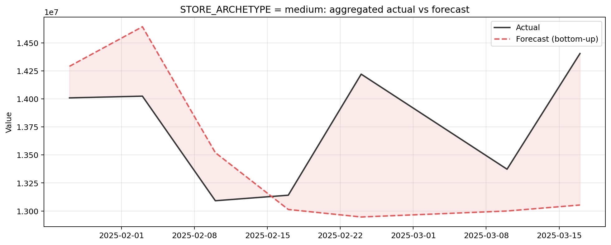
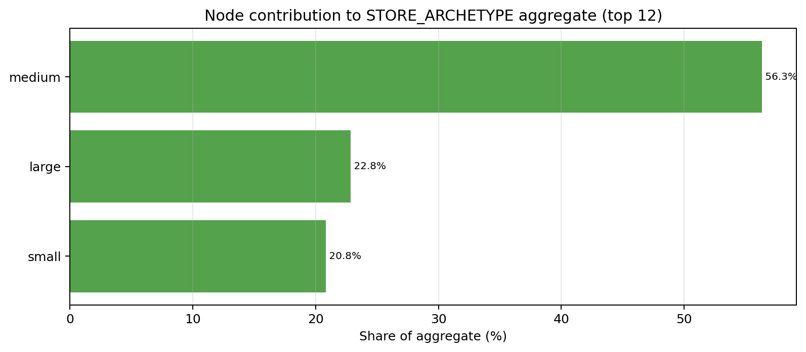
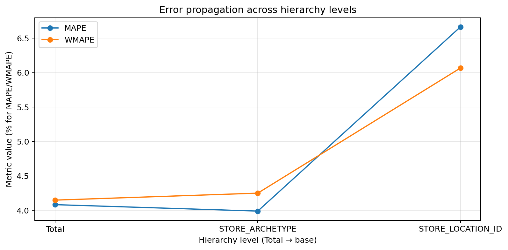
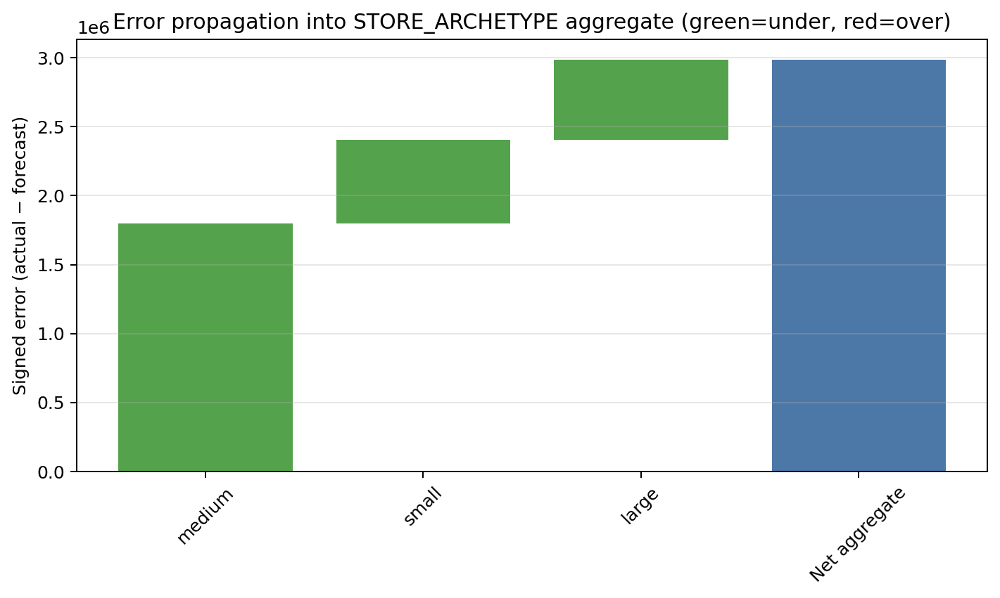

# Post-Forecasting Analysis - supermarket_net_sales_forecast

_Phase 6 final report. All findings were reviewed and approved at Checkpoints CP-0013 through CP-0017. The analysis was read-only: no model, forecast, or source table was modified._

## Executive summary

The selected global LightGBM `identity` forecast achieved **6.07% WMAPE** and **$29,578 MAE** over the approved period from **2025-01-27 through 2025-03-17**. It under-forecast by **$8,526 per store-week on average**. Aggregating the 50 stores through the confirmed `STORE_ARCHETYPE -> STORE_LOCATION_ID` hierarchy improved WMAPE to **4.25% at archetype level** and **4.15% at Total**, as **71.2% of gross base error cancelled**. The roll-up is coherent to a maximum absolute gap of **$0.000000**.

`medium` is the dominant archetype: it contributes **56.3%** of forecast value and **61.5%** of gross archetype error. All three archetypes retain net under-forecast bias, so aggregation reduces noise but does not remove the common directional miss.

## Model drivers and point explanations

Global gain importance is led by lag features (**75.4%**, almost entirely `lag1`), followed by static features (**17.2%**, led by `STORE_SELLING_AREA_SQFT`) and calendar features (**6.0%**, led by `week`). At the approved point-explanation date, 2025-03-17, mean absolute contributions followed the same ordering: lag **$40,987**, calendar **$21,796**, static **$5,982**, and categorical **$2,743**.

The five largest misses on 2025-03-17 were under-forecasts for stores 6, 49, 17, 26, and 31. Their additive explanations prominently involve `lag1`, `STORE_SELLING_AREA_SQFT`, and `week`. These values explain how the model formed its predictions; they are associative model evidence, not proof of business causation.

## Approved error scope and results

The approved scope is `y_hat_identity` only, covering **350 rows**, **50 stores**, and **7 available Mondays**. The source forecast frame has no row for 2025-03-03, and no value was imputed. There are no missing predictions, missing actuals, or zero/near-zero actuals in the evaluated rows.

| Metric | Result |
|---|---:|
| MAE | $29,578.42 |
| WMAPE | 6.07% |
| ME | +$8,525.96 (under-forecast) |
| RMSE | $37,233.38 |
| MAPE | 6.66% |
| sMAPE | 6.74% |

The worst date was **2025-03-17** (MAE $47,741); the worst month was **March 2025** (WMAPE 7.25%). The worst approved segment buckets were cluster `3.0`, `CENTRAL` region, and `large` archetype. No model-variant comparison was requested.

_Error distribution and weekly MAE across the approved seven-week evaluation window._

## Hierarchical reconciliation

The confirmed hierarchy is `STORE_ARCHETYPE -> STORE_LOCATION_ID`, reconciled bottom-up to `STORE_ARCHETYPE` over the same approved period and prediction column. Validation passed: all 50 stores map to exactly one non-null archetype.

| Archetype | Forecast share | Signed error | Gross-error share |
|---|---:|---:|---:|
| medium | 56.3% | +$1,795,845 | 61.5% |
| large | 22.8% | +$577,781 | 18.2% |
| small | 20.8% | +$610,459 | 20.3% |

The positive signed errors use `actual - forecast` and therefore indicate under-forecasting. Store-level WMAPE of 6.07% falls to 4.25% at archetype level and 4.15% at Total. This supports the approved interpretation that aggregation materially improves reliability through error cancellation, while the residual under-forecast across every archetype indicates systematic directional bias. No separately trained direct archetype forecast exists, so direct-versus-bottom-up and MinT comparisons are not applicable.

_Actual and forecast totals over time at the confirmed `STORE_ARCHETYPE` level._

_Each archetype's contribution to the bottom-up aggregate forecast._

_Accuracy from store level through archetype level to the grand total._

_Signed archetype errors showing cancellation and the residual under-forecast bias._

## Limitations and follow-up actions

- Reconcile the live Notebook 06 configuration with the earlier Phase 4.6 record: the analyzed run uses `W-MON`, the `identity` transform, an 18-column feature set, and revised cluster membership.
- Review whether `BASELINE_WEEKLY_SALES`, a near-target proxy, should remain in the feature set before future model selection or performance claims.
- Investigate the 2025-03-17 under-forecast and the `medium` archetype first, using the accepted lag/calendar/static contribution evidence without treating it as causal.
- Treat cluster `3.0` (3 stores) and `erratic` (2 stores) conclusions as low-confidence because of their small sample sizes.
- Determine why 2025-03-03 is absent before comparing contiguous weekly windows or operationalizing weekly monitoring.
- Persist trained model artifacts and exact run metadata in MLflow so future explainability can use the original fitted objects rather than a read-only reproduction.

## Artifacts

Detailed findings and supporting tables are in `forecast_explainability.md`, `feature_importance.csv`, `point_explanations.csv`, `error_analysis.md`, `error_metrics.csv`, `error_by_calendar.csv`, `error_by_segment.csv`, `hierarchical_reconciliation.md`, `reconciled_forecasts.csv`, `error_by_level.csv`, and `node_contributions.csv`. Supporting PNG charts are stored in this directory.