# Prompt 1 - EDA
## Text
I am running a demo to show your capabilites. In Fabric 02 ExploratoryDataAnalysis.ipynb you explored the target variable. Without re-running the notebooks, can you summarize your findings and tell me something more about overall seasonality? Use completion_report_mlads.md as a reference if you need to. 

## Output
### Target Variable Summary
Distribution: Right-skewed (skewness = 1.04, kurtosis = 1.33) with values ranging from ~$150K to $1.64M per store-week. Mean is $524K with a CV of 38.8%. No zeros, no negatives, no missing values — a clean, continuous target.

Store-level behavior: The 50 stores span a wide range of scales — from $282K/week (smallest) to $1.17M/week (largest). Importantly, larger stores tend to be more stable (lower CV ≈ 0.09–0.11), while smaller stores exhibit higher relative volatility (CV up to 0.21). Median CV across all stores is 0.137.

Collinearity finding: BASELINE_WEEKLY_SALES correlates at +0.94 with the target (near-perfect proxy), and TOTAL_TRANSACTIONS (+0.45) and TOTAL_GROSS_MARGIN (+0.41) are also collinear derivatives. All three were removed from the feature set.

### Seasonality Insights
The seasonality charts reveal a clear annual cycle with two distinct peaks:

1. Holiday peak (weeks 50–52, late December): The strongest spike — average weekly sales jump from ~$500K to over $700K. This corresponds to the Christmas/Boxing Day shopping surge. The aggregate series shows spikes to $35–37M total across all stores.

2. Summer peak (weeks 27–31, July–August): A secondary but pronounced rise to ~$670K mean. In the Canadian supermarket context, this aligns with summer BBQ season and back-to-school preparation.

3. Troughs: Early spring (weeks 14–18, April) is consistently the weakest period — mean sales dip to ~$450K. There's also a noticeable dip around week 25 (mid-June) before the summer surge.

4. Monthly view: November and December are the highest-revenue months (mean $630K), while March and April are the lowest ($470K). The difference between peak and trough months is roughly 35%, which is a meaningful seasonal amplitude for a grocery business.

5. Year-over-year consistency: The two years of data (Apr 2023–Mar 2025) show the pattern repeating cleanly — both holiday peaks are visible in the aggregate time series, confirming a stable 52-week seasonality. No obvious trend (upward or downward) across the two years.

This annual seasonality pattern motivated the lag strategy of [4, 8, 13, 26, 52] weeks in the feature engineering — the 52-week lag directly captures the year-over-year repeat, while 26 captures the half-year contrast.

## Prompt 1b - EDA
I see a peak around august, what do you think about it?

## Output
The August peak is very typical for Canadian grocery retail and likely driven by a combination of factors:

1. Civic Holiday long weekend (first Monday of August) — your HOLIDAY_CIVIC flag captures this. Long weekends drive entertaining/BBQ stock-up purchases.

2. Back-to-school preparation — late August is when families stock up on lunches, snacks, and pantry staples before September. This is one of the highest-spend grocery periods after the holidays.

3. Peak produce season — local fruits and vegetables are at peak availability in August, which drives higher basket sizes (consumers buy more fresh items at attractive prices).

4. Summer entertaining tail — the last big push of outdoor gatherings, cottage trips, and camping before Labour Day.

From a modeling perspective, this peak is well-handled by:

- The 52-week lag (captures last year's August directly)
- The HOLIDAY_CIVIC flag as a direct feature
- Weather features (lagged ≥4 weeks) — temperature correlates with summer purchasing behavior
  
One nuance: the August peak is "softer" than the December holiday spike — it's more of a 3–4 week elevated plateau rather than a sharp 1–2 week spike. This means rolling window features (especially the 4-week rolling mean) will pick it up well, whereas the December spike relies more heavily on the holiday flags for precise timing.

# Prompt 2 - Profiling
## Text
I am running a demo to show your capabilites. Can you generate again notebook 03 running it locally going again through all the check points? Use local data vailable in data folder. Stop at all check points with the data scientist. Use kernel all-purpose-time-series-forecasting. Save the new notebook as MLADS 03 ProfilingIntermittent.ipynb in the folder demo. Use completion_report_mlads.md as a reference if you need to. 

## Output
✅ CHECK POINT 1: Visualize demand over time

The plot shows 50 individual store time series over ~2 years (Apr 2023 – Mar 2025). Key observations:

- 50 distinct lines visible, each representing one store's weekly net sales
- Clear scale hierarchy — one dominant store peaks at ~$1.6M (orange line at top), most stores in the $200K–$800K range
- Strong annual seasonality — two visible December holiday spikes (Jan 2024 and Jan 2025) across all stores
- No gaps or zeros — all series are continuous with no missing demand periods
- Consistent behavior — no obvious structural breaks or anomalies

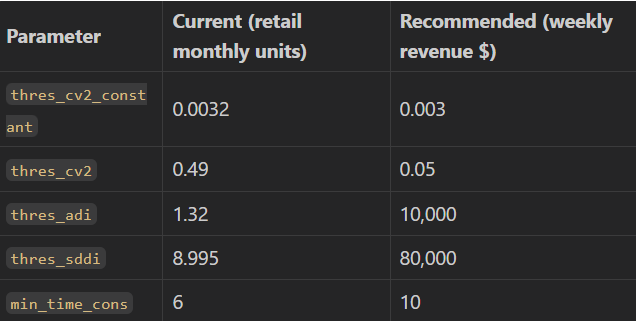

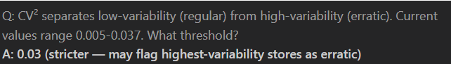

48 regular (smooth) series
2 erratic series (CV² > 0.03, meaning higher sales variability)

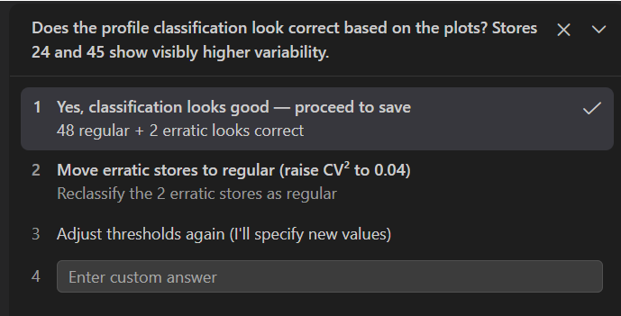

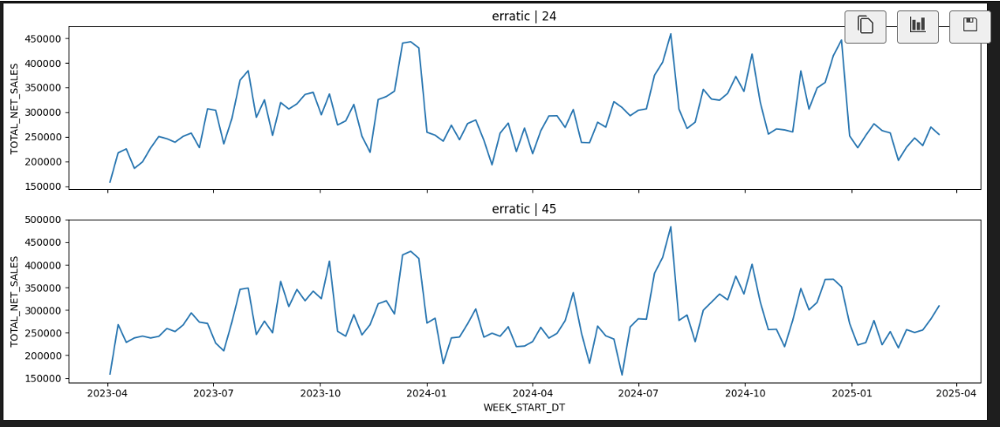

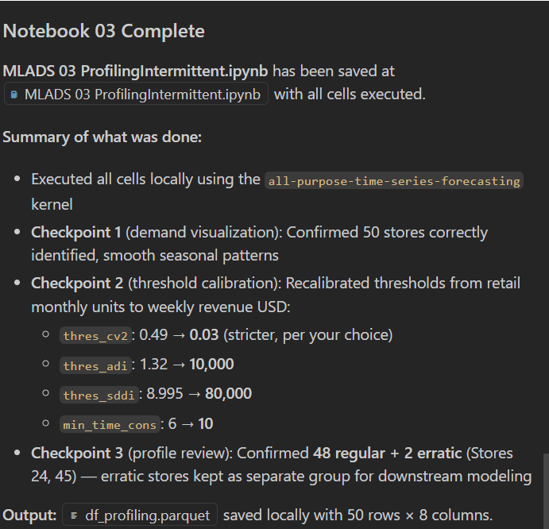

# Prompt 3 - Clustering

## Text
I am running a demo to show your capabilites. Can you generate again notebook 04 running it locally going again through all the check points? Use local data vailable in data folder. Stop at all check points with the data scientist, I want to revise try_cluster and choose the max number of clusters. Use kernel all-purpose-time-series-forecasting. Save the new notebook as MLADS 04 Clustering.ipynb in the folder demo. Use completion_report_mlads.md as a reference if you need to. 

## Output
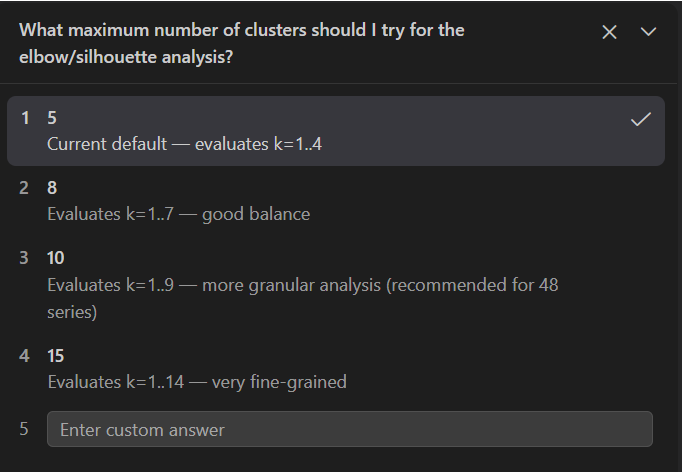

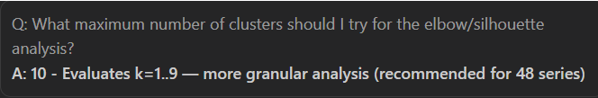

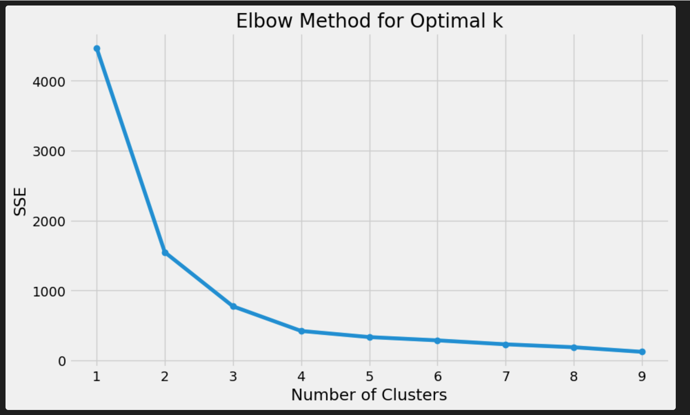

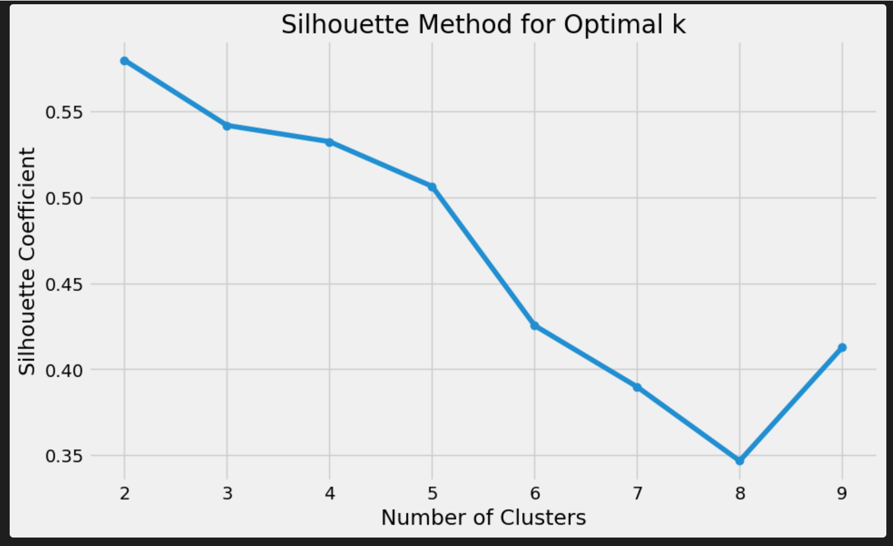

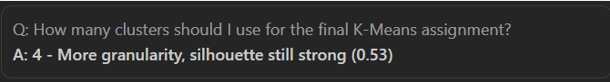

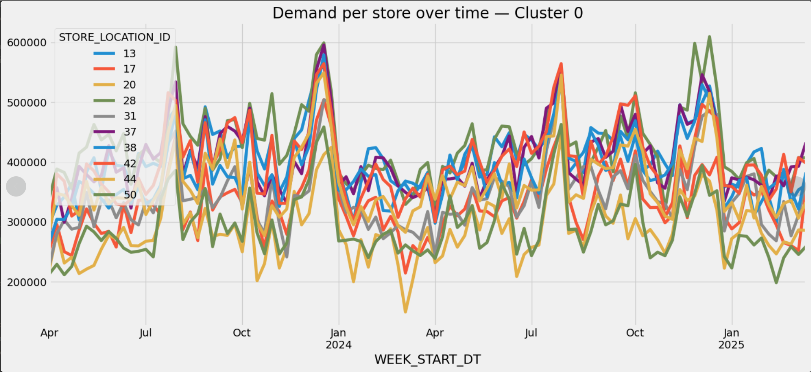

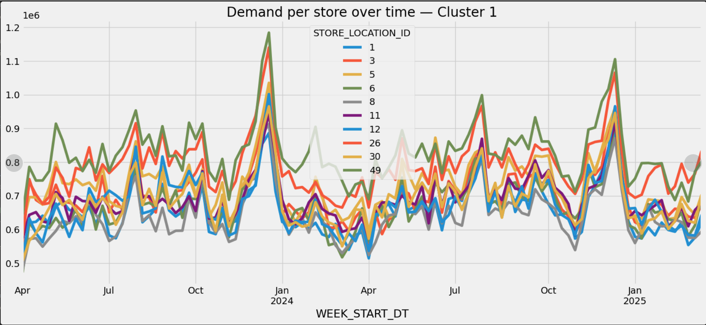

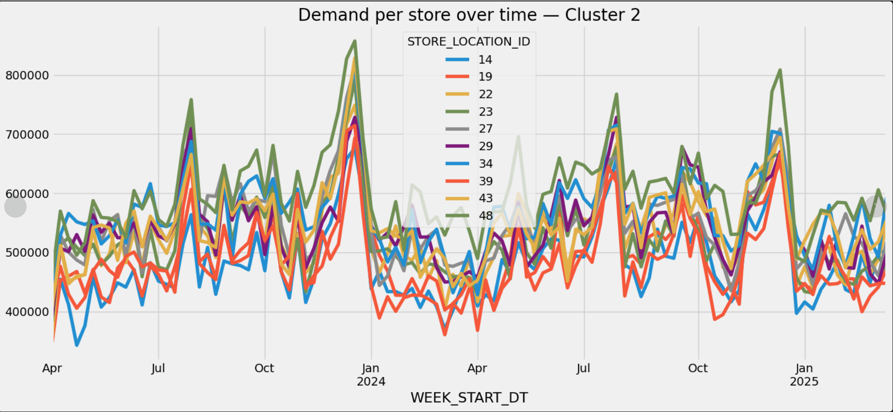

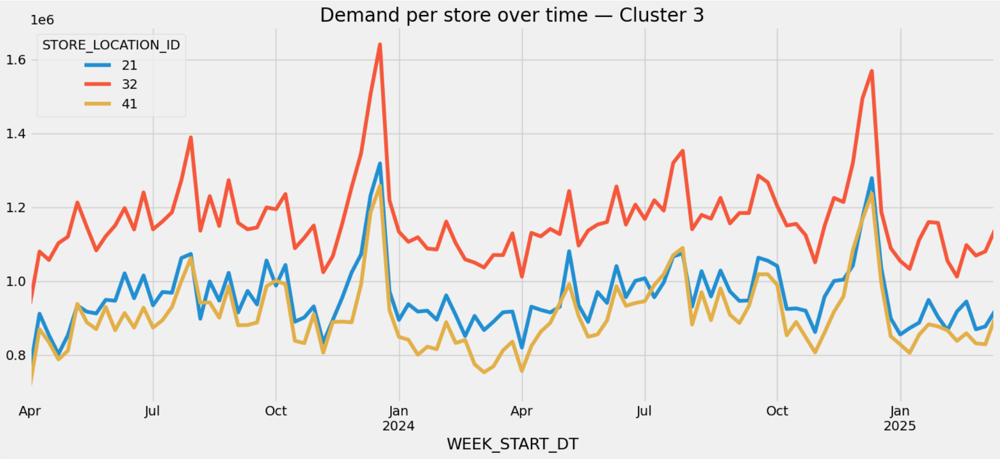

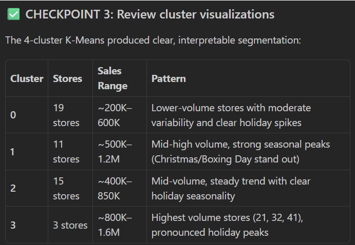

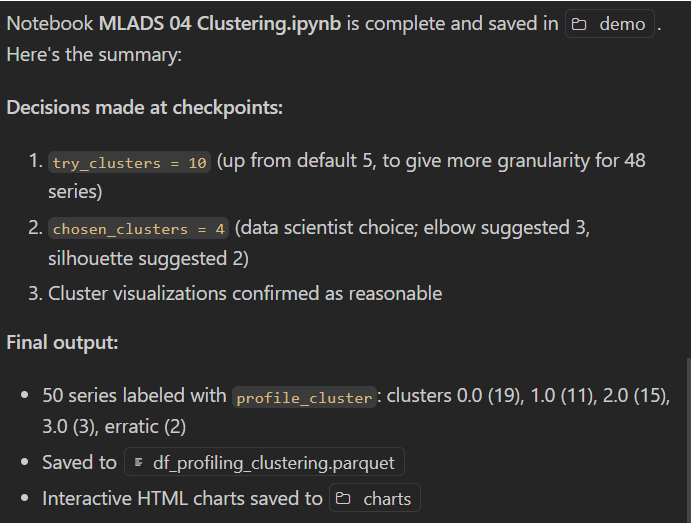

# Prompt 4 - Train/Test

## Text
I am running a demo to show your capabilites. Can you run MLADS 06 TrainTestSelectTune.ipynb locally and go through all check-points? Use local data available in data folder. Use kernel all-purpose-time-series-forecasting. Compare the global model and by-cluster model results, provide me a suggestion of which is best. 

## Output
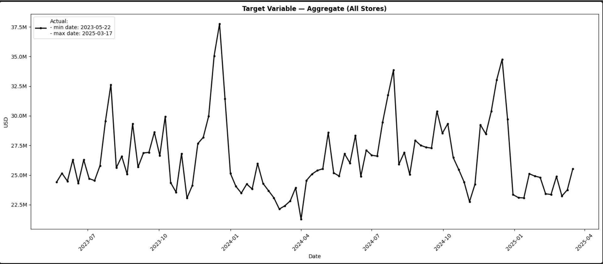

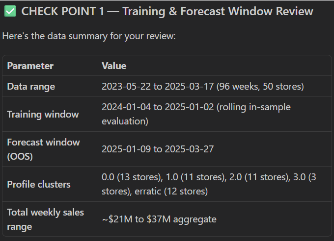

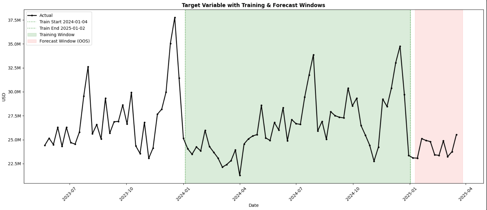

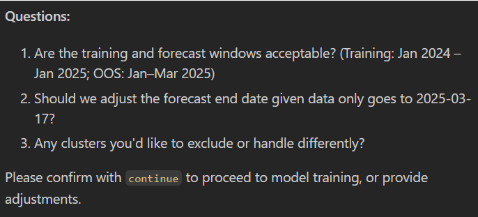

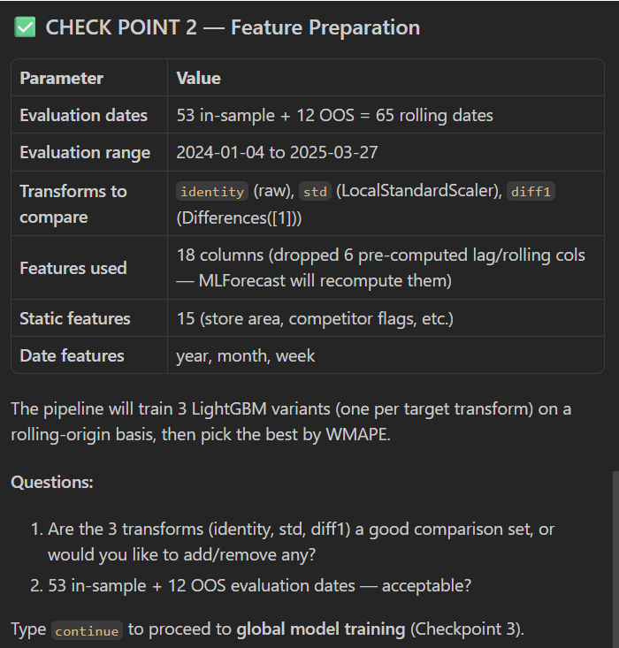

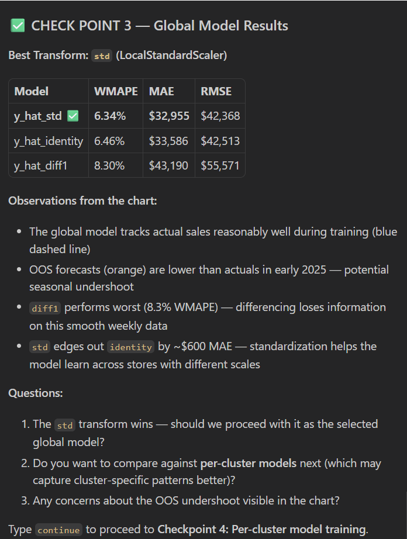

# Prompt 5 - MA Models
## Text
I am running a demo to show your capabilites. Can you generate a new notebook where you use moving average models for erratic profile_cluster only? Run the notebook locally using kernel all-purpose-time-series-forecasting. Use local data available in data folder. Use as parameters forecast start date '2025-01-13' and forecast end date '2025-05-20'. Compute metrics. Save the notebook as MLADS 06b TrainTestSelectTune.ipynb in the demo folder. Use completion_report_mlads.md as a reference if you need to. 

## Output

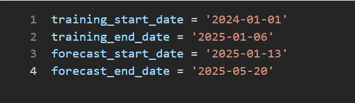

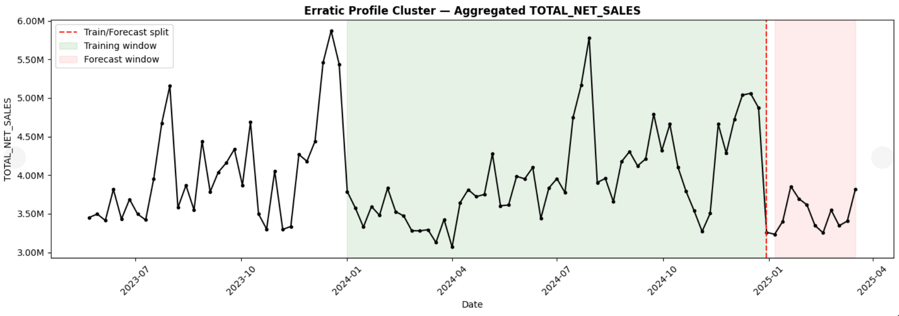

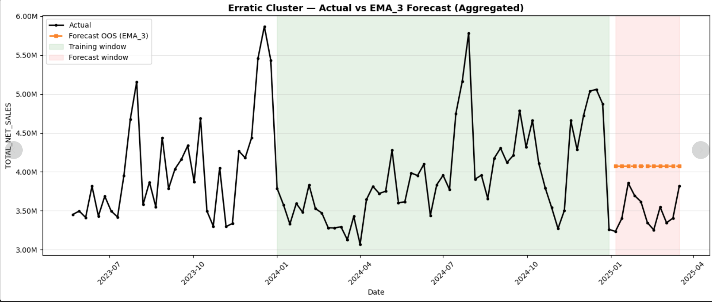

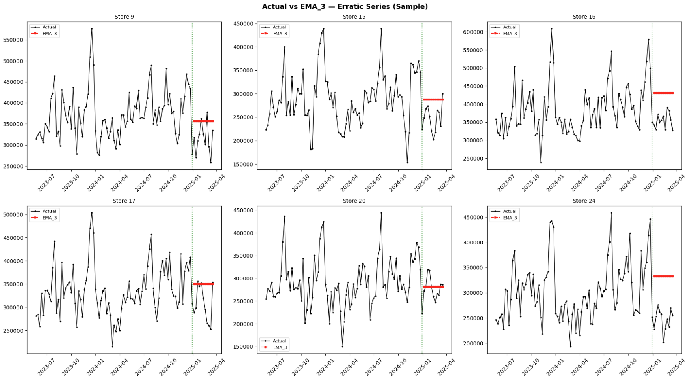

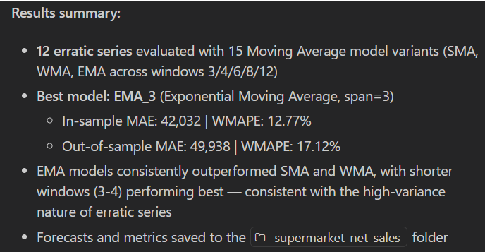

# Prompt 6 - Compare results

## Text
I am running a demo to show your capabilites. In demo folder you generated MLADS 06b TrainTestSelectTune.ipynb where you used moving average models for erratic profile_cluster. You also ran Light GBM as global model and at cluster level in Fabric 06 TrainTestSelectTune.ipynb. Without re-running the notebooks, can you compare the overall results and give me your feedback on modelling strategy?

## Output
### Results Comparison: LightGBM vs. Moving Average on Erratic Stores
Head-to-Head — Erratic Cluster (12 stores)

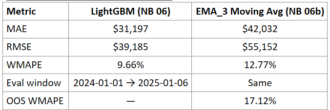

LightGBM wins decisively on the erratic cluster — even though these series were flagged as having high coefficient of variation, the ML model with lag/rolling features still outperforms all 15 moving average variants by a wide margin (~27% lower MAE).

### LightGBM Performance Across All Clusters (NB 06)

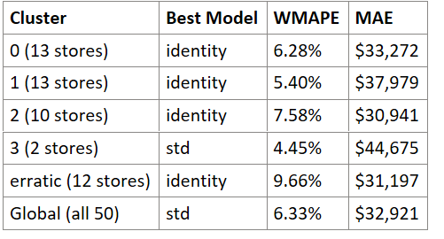

### Key Observations
1. LightGBM dominates even on erratic series. The erratic cluster's WMAPE (9.66%) is higher than other clusters as expected, but still materially better than the best moving average (12.77%). The ML model can exploit cross-series learning, static features (store size, competitors), and calendar effects that moving averages cannot.
2. Moving average OOS degradation is severe. EMA_3's out-of-sample WMAPE (17.12%) is 34% worse than its in-sample (12.77%), signalling overfitting to recent levels with no ability to anticipate trend shifts or seasonal effects.
3. Flat forecast problem. The MA forecasts are constant per store (same value every week) — they cannot capture weekly variation or upcoming events like holidays. LightGBM produces time-varying forecasts that respond to calendar features.
4. Global LightGBM vs. cluster-level. The global model (WMAPE 6.33%) slightly outperforms the cluster-level weighted average (WMAPE 6.58%) — indicating pooling information across all 50 stores helps regularize predictions.
   
### Strategy Recommendation
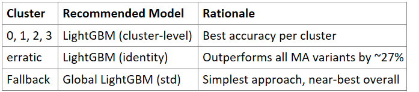

Bottom line: The moving average experiment confirmed that for this dataset, even "erratic" stores benefit from ML modelling. The feature engineering (lags, rolling stats, calendar dummies, static covariates) provides enough signal that LightGBM learns meaningful patterns the MA models miss. I would not recommend replacing LightGBM with moving averages for any cluster here — the erratic label reflects higher volatility, not absence of exploitable signal.
