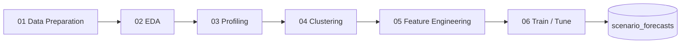

# FP&A Revenue Forecasting — Phase 2 Wiki

Welcome to the documentation wiki for the **HPE FP&A Revenue Forecasting – Phase 2** project: a Time Series Forecasting Accelerator built on a 6-notebook pipeline (LightGBM + `mlforecast`) with a library of pluggable analysis and benchmarking **skills**.

## What's here

| Section | Description |
|---------|-------------|
| [Getting Started](Getting-Started) | Environment, data expectations, how to run the pipeline |
| [Pipeline Overview](Pipeline-Overview) | The 6 notebooks and how data flows between them |
| [Skills Overview](Skills-Overview) | Pluggable skills for alternative models, explainability, and error analysis |

## The pipeline at a glance

Each notebook reads the table produced by the prior stage and writes its own output table, so stages are independently runnable and inspectable.

## Skills at a glance

Skills are additive, read-only extensions that plug into the pipeline outputs — they do **not** modify the core notebooks.

- **Alternative models** benchmarked against the LightGBM baseline: [Moving Average](Skill-forecasting-moving-average), [Prophet](Skill-forecasting-prophet), [Intermittent / Croston](Skill-forecasting-intermittent), [Chronos-2 foundation model](Skill-forecasting-chronos2).
- **Alternative clustering**: [DTW clustering](Skill-clustering-dtw) (shape-based alternative to notebook 04).
- **Diagnostics**: [Forecast Explainability](Skill-forecast-explainability), [Error Analysis](Skill-error-analysis), [Hierarchical Reconciliation](Skill-hierarchical-reconciliation).

## Publishing this wiki

This folder is authored to be published to the repository's **GitHub Wiki**. See [How to Publish](Publishing) for the steps.
