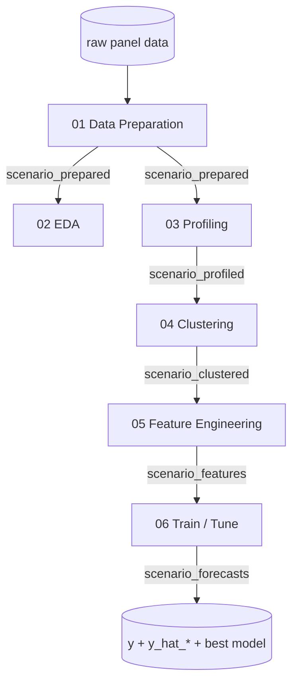

# Pipeline Overview

The accelerator is a 6-notebook pipeline. Each stage reads the table produced by the prior stage and writes its own output, so stages are independently runnable and inspectable.

## Stage-by-stage data flow

| Stage | Notebook | Reads | Writes | Purpose |
|-------|----------|-------|--------|---------|
| 1 | [01 Data Preparation](01-Data-Preparation) | raw panel | `*_prepared` | clean data, fill time gaps, handle missing values |
| 2 | [02 EDA](02-Exploratory-Data-Analysis) | `*_prepared` | (analysis only) | summary stats, visualizations |
| 3 | [03 Profiling](03-Profiling-Intermittent) | `*_prepared` | `*_profiled` | classify series (regular, intermittent, lumpy, erratic) |
| 4 | [04 Clustering](04-Clustering) | `*_profiled` | `*_clustered` | group regular series into `profile_cluster` |
| 5 | [05 Feature Engineering](05-Feature-Engineering) | `*_clustered` | `*_features` | lags, rolling stats, calendar features |
| 6 | [06 Train / Tune](06-Train-Test-Select-Tune) | `*_features` | `*_forecasts` | train per-cluster LightGBM, tune with Optuna |

## The output contract

Notebook 06 writes `<scenario>_forecasts` with:

- `unique_id` — series id
- `ds` — date
- `y` — actual value
- one or more `y_hat_*` — model predictions (e.g. `y_hat_identity`, `y_hat_std`)
- a selected best model per series/cluster

Most [skills](Skills-Overview) consume this table (and the `profile_cluster` label from stages 03/04) to benchmark or diagnose the baseline.

## Where skills plug in

| Plug-in point | Skills |
|---------------|--------|
| After **03 profiling**, alternative to **04** | [DTW Clustering](Skill-clustering-dtw) |
| After **06**, alternative models | [Moving Average](Skill-forecasting-moving-average), [Prophet](Skill-forecasting-prophet), [Intermittent](Skill-forecasting-intermittent), [Chronos-2](Skill-forecasting-chronos2) |
| After **06**, diagnostics | [Explainability](Skill-forecast-explainability), [Error Analysis](Skill-error-analysis), [Hierarchical Reconciliation](Skill-hierarchical-reconciliation) |
