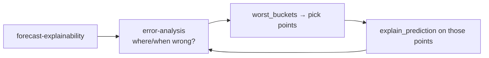

# Skill · Error Analysis

**Folder:** `.github/skills/error-analysis/`
**Runs after:** [Forecast Explainability](Skill-forecast-explainability)

## What it does

Evaluates forecast **accuracy** and decomposes the error by **calendar variables** — turning actuals-vs-predictions into headline metrics and error distributions that show *where* and *when* the forecast breaks down.

- **Headline metrics:** MAE, MAPE, ME (bias), RMSE (+ WMAPE, sMAPE)
- **Error by calendar:** year, quarter, month, week, day-of-week
- **Distributions:** box-plots per bucket, not just means
- **Worst buckets:** locate the biggest misses
- **Model comparison:** across all `y_hat_*` columns

## Error convention

`error = y_true - y_pred` (Hyndman): `> 0` under-forecast, `< 0` over-forecast; ME near 0 = unbiased.

## Recommended flow

Run **after** [Forecast Explainability](Skill-forecast-explainability): a number like "MAE is high in December" is only actionable once you know *why* the model produced it.

## Public API (selection)

`metric_summary` · `compare_models` · `metrics_by_calendar` · `error_boxplot` / `boxplot_grid` · `worst_buckets` · `narrate_errors`

## Files

- `evaluate.py` · `templates/example_usage.py` · `templates/error_analysis_report.md`
