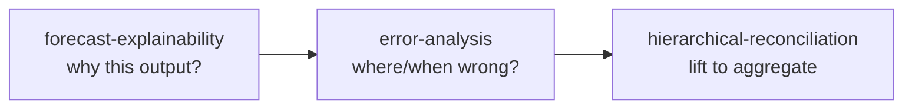

# Skill · Forecast Explainability

**Folder:** `.github/skills/forecast-explainability/`
**Runs after:** [05 Feature Engineering](05-Feature-Engineering) and [06 Train / Tune](06-Train-Test-Select-Tune)

## What it does

Explains **why** the LightGBM models produced their forecasts by analyzing **feature weights** and per-prediction contributions.

- **Feature importance** — gain vs split, per cluster
- **SHAP values** — per-point contribution breakdown
- **Single-prediction explanations** — why a specific forecast went up/down
- **Business narrative** — translate weights into plain language

## When to use

First step in the diagnostic flow — understand the model's drivers before asking where it is wrong.

## Scope

Built for the LightGBM + `mlforecast` pipeline (per-cluster `LGBMRegressor` models, `<scenario>_forecasts` tables). **Not** for training/tuning (notebook 06), feature engineering (notebook 05), or clustering (notebook 04).

## Files

- `explain.py` · templates
