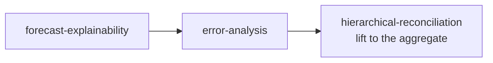

# Skill · Hierarchical Reconciliation

**Folder:** `.github/skills/hierarchical-reconciliation/`
**Runs after:** [Forecast Explainability](Skill-forecast-explainability) and [Error Analysis](Skill-error-analysis)

## What it does

Reconciles per-series forecasts across a **user-defined hierarchy** and diagnoses how base forecasts compose the aggregate and how errors propagate up.

- **Bottom-up aggregation** — roll base forecasts up to region / segment / product / category / total
- **Contribution analysis** — which nodes drive the total
- **Coherence** — make base and aggregate forecasts consistent
- **Error propagation** — do base errors cancel or reinforce at the top?
- **Charts** — waterfall of contributions, error by level

It **first asks** which columns are the hierarchical levels and at which level to aggregate, then charts the roll-up.

## When to use

The top of the diagnostic flow — lift the single-series findings from explainability and error analysis to the aggregate the business reports on.

## Scope

Built for the LightGBM + `mlforecast` pipeline base forecasts in `<scenario>_forecasts` (`unique_id`, `ds`, `y`, `y_hat_*`).

## Files

- `reconcile.py` · `templates/example_usage.py` · `templates/hierarchical_reconciliation_report.md`
