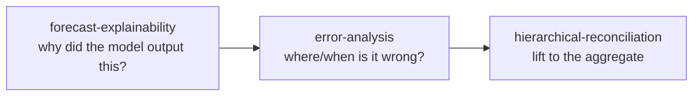

# Skills Overview

Skills are **pluggable, additive extensions** for the pipeline. They live in `.github/skills/`, each as a `SKILL.md` plus a Python module and templates. They are **read-only** with respect to the core pipeline — they consume its outputs (the `profile_cluster` label and the `<scenario>_forecasts` baseline) without modifying the notebooks.

## Categories

### Alternative clustering
| Skill | What it does |
|-------|--------------|
| [DTW Clustering](Skill-clustering-dtw) | Cluster regular series by **shape** using Dynamic Time Warping — a drop-in alternative to the Euclidean K-Means in [04 Clustering](04-Clustering), same output contract. |

### Alternative forecasting models (benchmarked vs LightGBM)
Each runs **twice** — globally over the whole panel and **per `profile_cluster`** — then compares MAE/RMSE/WMAPE/ME against the notebook-06 `y_hat_*` baseline on identical backtest windows.

| Skill | Model family | Best for |
|-------|--------------|----------|
| [Moving Average](Skill-forecasting-moving-average) | rolling / seasonal window average | smooth, stable, seasonal series |
| [Prophet](Skill-forecasting-prophet) | additive trend + seasonality + holidays | strong seasonality / holiday effects |
| [Intermittent / Croston](Skill-forecasting-intermittent) | Croston, SBA, TSB, ADIDA, IMAPA | sparse / lumpy demand |
| [Chronos-2](Skill-forecasting-chronos2) | pretrained foundation model (zero-shot) | cross-learning, no training |

### Diagnostics
| Skill | Question it answers |
|-------|--------------------|
| [Forecast Explainability](Skill-forecast-explainability) | *Why* did the model output this? (feature weights, SHAP) |
| [Error Analysis](Skill-error-analysis) | *Where/when* is the forecast wrong? (error by calendar) |
| [Hierarchical Reconciliation](Skill-hierarchical-reconciliation) | How do base forecasts roll up and how do errors propagate? |

## Recommended diagnostic flow

## Dependencies note

Several skills require packages **not yet** in `requirements.txt` — each skill flags its own:

| Skill | Extra dependency |
|-------|------------------|
| DTW Clustering | `tslearn>=0.6.3` |
| Moving Average / Intermittent | `statsforecast>=1.7.0` |
| Prophet | `prophet` |
| Chronos-2 | `chronos` / foundation-model runtime |
